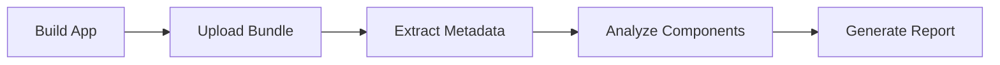

The Bundle Analysis service helps you track your app's size over time, identify what contributes to bundle bloat, and optimize your app for faster downloads and better user experience.

## Overview

Bundle Analysis provides:

- **Size tracking**: Monitor download and install sizes
- **Component breakdown**: See what takes up space
- **Trend analysis**: Track size changes over time
- **Regression detection**: Alert on unexpected size increases
- **Optimization recommendations**: Suggestions to reduce size



## Prerequisites

1. [Authenticate with Tuist Cloud](/cloud/authentication)
2. Configure your project:

```swift Config.swift
import ProjectDescription

let config = Config(
    cloud: .cloud(
        url: "https://cloud.tuist.io",
        projectId: "your-org/your-project"
    )
)
```

## Uploading Bundles for Analysis

### iOS Bundles (IPA)

Upload an IPA for analysis:

```bash
tuist build MyApp --platform iOS --configuration Release
tuist bundle upload MyApp
```

Tuist will:

1. Extract the IPA contents
2. Analyze all components (binaries, assets, resources)
3. Calculate download and install sizes
4. Upload analysis to cloud

### macOS Bundles (.app)

Analyze macOS app bundles:

```bash
tuist build MyMacApp --platform macOS --configuration Release
tuist bundle upload MyMacApp --platform macOS
```

### Android Bundles (APK/AAB)

Upload Android bundles:

```bash
# APK analysis
tuist bundle upload MyApp.apk --platform Android

# AAB analysis
tuist bundle upload MyApp.aab --platform Android
```

### Archives (.xcarchive)

Analyze Xcode archives:

```bash
tuist bundle upload MyApp.xcarchive
```

<Info>
  Bundle analysis automatically happens when you upload previews with `tuist share`.
</Info>

## Bundle Components

### What Gets Analyzed

The service analyzes:

- **Executables**: Main binary and embedded frameworks
- **Assets**: Images, icons, asset catalogs
- **Resources**: Localization files, fonts, data files
- **Frameworks**: Embedded frameworks and libraries
- **Debug symbols**: dSYM files (if included)

### Size Metrics

Two key metrics are tracked:

1. **Download size**: Compressed size users download from the App Store
2. **Install size**: Uncompressed size on device

```
Download size: 25.3 MB
Install size: 67.8 MB
Compression ratio: 2.68x
```

## Viewing Bundle Analysis

### List Bundles

View all analyzed bundles:

```bash
tuist bundle list
```

Shows:
- Bundle version and build number
- Upload date
- Download and install sizes
- Platform and supported devices

### Bundle Details

Get detailed analysis for a specific bundle:

```bash
tuist bundle show bundle-id-123
```

Displays:
- Size breakdown by component type
- Largest files
- Comparison with previous version
- Optimization suggestions

### Web Dashboard

Access the bundle analysis dashboard:

```
https://cloud.tuist.io/your-org/your-project/bundles
```

The dashboard provides:
- Interactive size trend charts
- Component breakdown visualizations
- File-level drill-down
- Historical comparisons

## Component Breakdown

### By File Type

See size distribution by file type:

```
Executables:    15.2 MB (22.4%)
Images:         28.5 MB (42.0%)
Asset Catalogs: 12.3 MB (18.1%)
Fonts:           4.2 MB  (6.2%)
Localizations:   3.8 MB  (5.6%)
Other:           3.8 MB  (5.6%)
─────────────────────────────
Total Install:  67.8 MB
```

### By Framework

Break down by embedded frameworks:

```
MyApp:           15.2 MB
Networking:       3.5 MB
UI:               5.8 MB
ThirdParty:       8.2 MB
```

### Largest Files

Identify the biggest individual files:

```
1. background_video.mp4     - 8.5 MB
2. app_binary               - 7.2 MB
3. icon_assets.car          - 4.3 MB
4. font_family.ttf          - 2.8 MB
5. translations.lproj       - 1.9 MB
```

## Size Trends

### Historical Tracking

Track size changes over time:

```
Version   Download  Install   Change
2.1.0     25.3 MB   67.8 MB   +1.2 MB
2.0.0     24.1 MB   65.6 MB   -0.5 MB
1.9.0     24.6 MB   68.1 MB   +3.2 MB
1.8.0     21.4 MB   59.9 MB   baseline
```

### Size Budget

Set size budgets and get alerts:

```swift Config.swift
let config = Config(
    cloud: .cloud(
        url: "https://cloud.tuist.io",
        projectId: "your-org/your-project",
        options: .options(
            bundleSizeBudget: .budget(
                downloadSize: 30 * 1024 * 1024,  // 30 MB
                installSize: 75 * 1024 * 1024     // 75 MB
            )
        )
    )
)
```

When a build exceeds the budget:
- CI builds fail
- Team receives notifications
- Analysis shows what caused the increase

## Regression Detection

### Automatic Alerts

Get notified when bundle size increases unexpectedly:

```
⚠️ Bundle size increased by 15% (3.2 MB)
   Largest additions:
   - new_feature_assets.car (+2.1 MB)
   - updated_framework (+1.1 MB)
```

### CI Integration

Fail CI builds on size regressions:

```yaml .github/workflows/build.yml
name: Build
on: [pull_request]

jobs:
  build:
    runs-on: macos-latest
    steps:
      - uses: actions/checkout@v4
      
      - name: Install Tuist
        run: curl -Ls https://install.tuist.io | bash
      
      - name: Authenticate
        run: tuist auth login
      
      - name: Build and analyze
        run: tuist build MyApp --platform iOS --configuration Release
      
      - name: Upload bundle
        run: tuist bundle upload MyApp --fail-on-regression
```

### PR Comments

Post bundle analysis on pull requests:

```yaml
- name: Comment PR with bundle size
  uses: actions/github-script@v7
  with:
    script: |
      const analysis = JSON.parse(process.env.BUNDLE_ANALYSIS);
      await github.rest.issues.createComment({
        issue_number: context.issue.number,
        owner: context.repo.owner,
        repo: context.repo.repo,
        body: `## Bundle Size Analysis\n\n` +
              `Download: ${analysis.downloadSize}\n` +
              `Install: ${analysis.installSize}\n` +
              `Change: ${analysis.change}`
      });
```

## Optimization Recommendations

### Image Optimization

Tuist identifies opportunities to:

- Convert images to WebP or HEIC
- Remove unused @3x assets
- Compress asset catalogs
- Use lossy compression where appropriate

### Asset Catalog Analysis

Suggestions for asset catalogs:

```
💡 Optimization Opportunities

1. Icons.xcassets contains 12 unused images (2.3 MB)
2. Consider using vector PDFs instead of PNG @2x/@3x (save ~1.5 MB)
3. Some images can be compressed further (save ~800 KB)
```

### Framework Optimization

- Identify unused frameworks to remove
- Suggest dynamic framework candidates
- Recommend framework thinning

### Code Optimization

- Dead code detection
- Unused symbols
- Duplicate symbols across frameworks

## App Store Size Estimation

### Universal vs App Thinning

Compare universal binary size with thinned sizes:

```
Universal (all architectures):
  Download: 45.2 MB
  Install: 120.5 MB

App Thinned for iPhone 15 Pro:
  Download: 25.3 MB
  Install: 67.8 MB
  
Savings: 19.9 MB (44%)
```

### Per-Device Estimates

Estimate size for different devices:

```
iPhone SE (2nd gen):  24.1 MB
iPhone 15:            25.3 MB
iPhone 15 Pro Max:    26.8 MB
iPad Air:             27.5 MB
```

## Advanced Analysis

### Binary Symbol Analysis

Analyze what's in your executable:

```bash
tuist bundle symbols MyApp
```

Shows:
- Largest symbols
- Unused symbols (with optimization flags)
- Swift vs Objective-C distribution
- Standard library overhead

### Localization Analysis

Break down by language:

```
English:    1.2 MB (baseline)
Spanish:    1.3 MB (+100 KB)
French:     1.3 MB (+100 KB)
German:     1.4 MB (+200 KB)
Japanese:   1.8 MB (+600 KB)
```

Recommendations:
- Remove unused localizations
- Use on-demand resources
- Optimize string files

### On-Demand Resources

Track on-demand resource usage:

```
Initial Download:  25.3 MB
On-Demand:
  Level Packs:      12.5 MB
  Extra Content:     8.2 MB
```

## CI/CD Integration

### Automated Bundle Uploads

```yaml .github/workflows/release.yml
name: Release
on:
  push:
    tags:
      - 'v*'

jobs:
  release:
    runs-on: macos-latest
    steps:
      - uses: actions/checkout@v4
      
      - name: Install Tuist
        run: curl -Ls https://install.tuist.io | bash
      
      - name: Authenticate
        run: tuist auth login
      
      - name: Build release
        run: tuist build MyApp --platform iOS --configuration Release
      
      - name: Upload to TestFlight
        run: xcrun altool --upload-app -f MyApp.ipa ...
      
      - name: Analyze bundle
        run: tuist bundle upload MyApp --tag ${{ github.ref_name }}
```

### Size Regression Check

```bash
#!/bin/bash
# Add to CI pipeline

BASE_SIZE=$(tuist bundle list --branch main --latest --json | jq '.installSize')
CURRENT_SIZE=$(tuist bundle upload MyApp --json | jq '.installSize')
DIFF=$((CURRENT_SIZE - BASE_SIZE))
DIFF_PCT=$((100 * DIFF / BASE_SIZE))

if [ $DIFF_PCT -gt 10 ]; then
  echo "❌ Bundle size increased by ${DIFF_PCT}% (${DIFF} bytes)"
  exit 1
fi

echo "✅ Bundle size within acceptable range"
```

## Best Practices

<AccordionGroup>
  <Accordion title="Set and enforce size budgets">
    Define acceptable size limits and fail CI builds that exceed them.
  </Accordion>
  
  <Accordion title="Analyze every release candidate">
    Always run bundle analysis before submitting to App Store.
  </Accordion>
  
  <Accordion title="Track size in code review">
    Include bundle size changes in PR descriptions and reviews.
  </Accordion>
  
  <Accordion title="Optimize assets regularly">
    Run asset optimization passes quarterly to compress and remove unused assets.
  </Accordion>
  
  <Accordion title="Use on-demand resources">
    Move non-essential content to on-demand resources to reduce initial download.
  </Accordion>
</AccordionGroup>

## Troubleshooting

### Analysis Fails

If bundle analysis fails:

1. Verify the bundle is valid and builds successfully
2. Check authentication: `tuist auth whoami`
3. Ensure sufficient storage quota

### Inaccurate Size Estimates

If size estimates seem wrong:

1. Compare with actual App Store Connect sizes
2. Verify bitcode settings (if applicable)
3. Check app thinning configuration

### Missing Components

If some components aren't analyzed:

1. Ensure all assets are included in the bundle
2. Verify embedded frameworks are present
3. Check that the archive includes all targets

## Next Steps

<CardGroup cols={2}>
  <Card title="Build Insights" icon="chart-line" href="/cloud/insights">
    View bundle size trends in the insights dashboard
  </Card>
  <Card title="Optimization Guide" icon="gauge" href="/guides/build-optimization">
    Learn techniques to reduce app size
  </Card>
</CardGroup>
