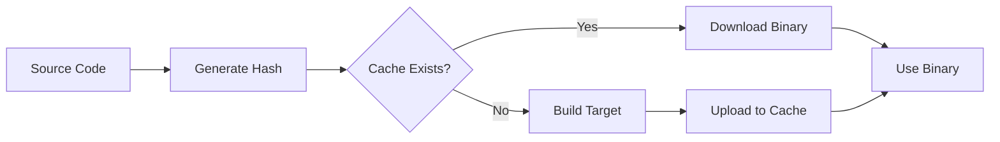

Tuist Cache is a service that stores compiled binaries of your frameworks and targets in the cloud. When you or your team rebuild the project, Tuist fetches pre-built binaries instead of recompiling unchanged code, dramatically reducing build times.

## How It Works

The cache service works by:

1. **Hashing** each target based on its source files, dependencies, and build settings
2. **Checking** if a cached binary exists for that hash
3. **Downloading** the cached binary if available, or building and uploading if not
4. **Replacing** source targets with their cached binaries in your Xcode project



## Prerequisites

Before using the cache:

1. [Authenticate with Tuist Cloud](/cloud/authentication)
2. Configure your project in `Config.swift`

```swift Config.swift
import ProjectDescription

let config = Config(
    cloud: .cloud(
        url: "https://cloud.tuist.io",
        projectId: "your-org/your-project"
    ),
    cache: .cache(
        // Cache configuration options
    )
)
```

## Warming the Cache

The `tuist cache warm` command builds targets and uploads them to the cache:

```bash
tuist cache warm
```

### Cache Specific Targets

Cache only specific targets and their dependencies:

```bash
tuist cache warm MyFramework AnotherFramework
```

### Cache Only Dependencies

Cache dependencies without caching the specified targets:

```bash
tuist cache warm MyApp --external-only
```

This is useful when you're actively developing `MyApp` but want to cache its dependencies.

### Using a Specific Configuration

Cache using a specific build configuration:

```bash
tuist cache warm --configuration Release
```

<Info>
  By default, Tuist caches using the Debug configuration. Use Release configuration for production CI pipelines.
</Info>

## Using Cached Binaries

When you generate your project, Tuist automatically uses cached binaries:

```bash
tuist generate
```

Targets with available cached binaries are replaced with their pre-built versions. You'll see output like:

```
✓ Using cached binary for MyFramework
✓ Using cached binary for Networking
✓ Building MyApp from source
```

## Cache in CI/CD

Integrate caching into your CI pipeline to speed up builds:

```yaml .github/workflows/build.yml
name: Build
on: [push]

jobs:
  build:
    runs-on: macos-latest
    steps:
      - uses: actions/checkout@v4
      
      - name: Install Tuist
        run: curl -Ls https://install.tuist.io | bash
      
      - name: Authenticate
        run: tuist auth login
      
      - name: Warm cache
        run: tuist cache warm --configuration Release
      
      - name: Build project
        run: tuist build
```

### Branch-Based Caching

Cache is automatically scoped by:
- Project configuration
- Git branch
- Target hashes

This ensures that different branches can have different cached artifacts without conflicts.

## Cache Configuration

Customize cache behavior in your `Config.swift`:

```swift Config.swift
import ProjectDescription

let config = Config(
    cache: .cache(
        path: .relativeToRoot(".tuist/cache"),
        profiles: [
            .profile(
                name: "Simulator",
                configuration: "Debug",
                device: .iPhone("iPhone 15 Pro")
            ),
            .profile(
                name: "Device",
                configuration: "Release",
                device: .device
            )
        ]
    )
)
```

### Cache Profiles

Cache profiles allow you to maintain separate caches for different build configurations:

```bash
# Cache for simulator builds
tuist cache warm --profile Simulator

# Cache for device builds  
tuist cache warm --profile Device
```

## Checking Cache Configuration

View your current cache configuration:

```bash
tuist cache config
```

This displays:
- Cache storage location
- Configured profiles
- Server connection status

## Cache Operations

### Check if a Target is Cached

You can check if specific targets have cached versions available without building:

```bash
tuist cache config
```

### Print Cache Hashes

View the cache hashes for all cacheable targets:

```bash
tuist hash cache
```

This is useful for:
- Debugging cache misses
- Understanding what triggers cache invalidation
- Verifying cache configuration

## Understanding Cache Hits and Misses

### What Invalidates the Cache?

The cache for a target is invalidated when:

- **Source files** change
- **Build settings** are modified
- **Dependencies** are updated
- **Xcode version** changes (by default)
- **SDK version** changes

### Maximizing Cache Hits

To get the most out of caching:

1. **Modularize your project**: Smaller targets cache independently
2. **Stable dependencies**: Keep third-party dependencies on fixed versions
3. **Consistent build settings**: Avoid configuration-specific customizations
4. **Team alignment**: Ensure everyone uses the same Xcode version

## Cache Storage

Cached artifacts are stored in:

- **Remote**: Tuist Cloud (S3-compatible storage)
- **Local**: `~/.tuist/Cache` on your machine

Local cache is used as a fallback when offline or for faster access.

### Storage Locations

```bash
# Local cache directory
~/.tuist/Cache/

# Project-specific cache metadata
.tuist/Cache/
```

## Cache Analytics

Cache usage metrics are automatically sent to Tuist Cloud (if enabled), providing insights into:

- Cache hit/miss rates
- Build time savings
- Storage usage
- Most frequently cached targets

<Card title="View cache insights" icon="chart-line" href="/cloud/insights">
  Analyze cache performance in the Insights dashboard
</Card>

## Advanced Usage

### Content-Addressable Storage (CAS)

Tuist uses content-addressable storage for caching, which:

- Deduplicates identical files across targets
- Enables partial cache downloads
- Optimizes storage efficiency

### Selective Testing with Cache

Use cache data to run only tests affected by your changes:

```bash
tuist test --selective
```

<Card title="Learn about selective testing" icon="flask" href="/features/selective-testing">
  Discover how to speed up test runs
</Card>

## Troubleshooting

### Cache Always Misses

If you're experiencing constant cache misses:

1. Check that everyone uses the same Xcode version
2. Verify build settings are consistent
3. Ensure `.tuist-version` is committed
4. Run `tuist hash cache` to inspect target hashes

### Build Fails with Cached Binaries

If a build fails when using cached binaries:

```bash
# Force rebuild without cache
tuist clean
tuist cache warm
tuist generate
```

### Slow Cache Downloads

If cache downloads are slow:

- Check your network connection
- Verify server location is geographically close
- Consider self-hosting for better performance

## Best Practices

<AccordionGroup>
  <Accordion title="Warm cache on main branch regularly">
    Set up CI to warm the cache after every merge to main. This ensures developers always have recent cached artifacts.
  </Accordion>
  
  <Accordion title="Use cache profiles for different scenarios">
    Create separate profiles for simulator vs device builds, debug vs release, etc.
  </Accordion>
  
  <Accordion title="Monitor cache hit rates">
    Track cache hit rates in the Insights dashboard to identify optimization opportunities.
  </Accordion>
  
  <Accordion title="Keep dependencies stable">
    Lock third-party dependency versions to maximize cache reuse across the team.
  </Accordion>
</AccordionGroup>

## Next Steps

<CardGroup cols={2}>
  <Card title="Selective Testing" icon="flask" href="/features/selective-testing">
    Use cache data to run only affected tests
  </Card>
  <Card title="Build Insights" icon="chart-line" href="/cloud/insights">
    Analyze cache performance and build metrics
  </Card>
</CardGroup>
