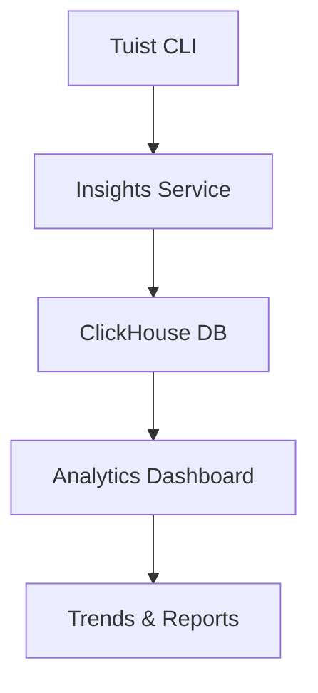

Tuist Insights provides analytics and visualization of your build and test data, helping you identify performance bottlenecks, track trends, and make data-driven decisions to improve your development workflow.

## Overview

Insights collect and analyze data from:

- **Build runs**: Duration, success rate, file compilation times
- **Cache operations**: Hit rates, download/upload times
- **Test runs**: Pass/fail rates, test duration, flaky tests
- **Bundle sizes**: App size trends, asset analysis
- **CAS operations**: Content-addressable storage metrics



## Prerequisites

1. [Authenticate with Tuist Cloud](/cloud/authentication)
2. Configure your project:

```swift Config.swift
import ProjectDescription

let config = Config(
    cloud: .cloud(
        url: "https://cloud.tuist.io",
        projectId: "your-org/your-project"
    )
)
```

Insights are automatically collected when you use Tuist Cloud services. No additional setup is required.

## Build Insights

### Build Duration Trends

Track how build times change over time:

- **Total build duration**: End-to-end build time
- **Clean vs incremental**: Compare different build types
- **Per-target duration**: Identify slow-building targets
- **File compilation time**: Find slow-compiling files

View in the web dashboard:

```
https://cloud.tuist.io/your-org/your-project/insights/builds
```

### Build Success Rate

Monitor build reliability:

- Success vs failure rate over time
- Most common build errors
- Error frequency by target
- CI vs local build success rates

### Compilation Metrics

Analyze what takes time during compilation:

- **Swift compilation**: Files and targets
- **C/Obj-C compilation**: Header processing time
- **Linking**: Final binary linking duration
- **Asset compilation**: Asset catalog processing

### Build Comparison

Compare builds across:

- **Branches**: Compare feature branches to main
- **Time periods**: Week-over-week, month-over-month
- **Developers**: Team member performance
- **CI providers**: Different CI systems

## Cache Insights

### Cache Hit Rate

Track cache effectiveness:

- **Overall hit rate**: Percentage of cache hits
- **Per-target hit rate**: Which targets cache well
- **Hit rate trends**: How cache performance changes
- **Miss reasons**: Why cache misses occur

### Cache Operations

Monitor cache usage:

- **Upload frequency**: How often artifacts are uploaded
- **Download volume**: Amount of data downloaded
- **Storage usage**: Total cache storage consumed
- **Bandwidth usage**: Network traffic patterns

### Time Savings

Quantify cache benefits:

```
Total build time without cache: 45m
Total build time with cache: 8m
Time saved: 37m (82% faster)
```

### Cache by Configuration

Compare cache performance across:

- Debug vs Release configurations
- Simulator vs Device builds
- Different cache profiles

## Test Insights

### Test Execution Trends

Track test performance:

- **Test duration**: Total and per-test time
- **Test count**: Number of tests over time
- **Pass/fail rate**: Test reliability
- **Skipped tests**: Tests marked as skipped

### Flaky Test Detection

Identify unreliable tests:

- Tests with inconsistent results
- Flakiness percentage
- Impact on CI reliability
- Recommended fixes

### Test Coverage Trends

Monitor code coverage:

- Overall coverage percentage
- Coverage by target
- Coverage trends over time
- Uncovered files and functions

### Slow Tests

Find performance bottlenecks:

- Slowest test cases
- Tests with increasing duration
- Test timeout failures
- Recommended parallelization

## Bundle Insights

<Card title="Learn more about Bundle Analysis" icon="box" href="/cloud/bundle-analysis">
  Detailed bundle size tracking and optimization recommendations
</Card>

### Size Trends

Track app bundle size:

- **Total app size**: Download and install sizes
- **Size per release**: Version-over-version changes
- **Size by platform**: iOS, macOS, visionOS, etc.
- **Size regressions**: Unexpected size increases

### Asset Analysis

Break down what contributes to app size:

- **Images and assets**: Asset catalog size
- **Frameworks**: Embedded framework sizes
- **Resources**: Localization, fonts, etc.
- **Binaries**: Executable and library sizes

## Command Events

Track CLI usage across your team:

- **Most used commands**: Which commands are run frequently
- **Command duration**: How long commands take
- **Error rates**: Which commands fail most often
- **User adoption**: Team members using Tuist

### Command Analytics

View metrics for:

- `tuist generate`
- `tuist build`
- `tuist test`
- `tuist cache warm`
- `tuist share`

Understand how your team uses Tuist to optimize workflows.

## Environment Metrics

### Development Environment

Track environment diversity:

- **Xcode versions**: Which versions are in use
- **macOS versions**: OS distribution
- **Hardware**: Mac models and specs
- **CI providers**: Which CI systems are used

### Build Matrix

See which configurations are tested:

- iOS versions
- Device types
- Build configurations (Debug/Release)
- Architectures (arm64, x86_64)

## CI/CD Insights

### CI Build Performance

Analyze CI-specific metrics:

- **CI build duration**: Total pipeline time
- **Queue time**: Time waiting for CI resources
- **Cache effectiveness in CI**: CI-specific cache hit rate
- **Parallelization**: How well tests parallelize

### CI Provider Comparison

Compare different CI systems:

- GitHub Actions vs GitLab CI
- Build times by provider
- Success rates
- Cost efficiency

### CI Optimization Recommendations

Get suggestions for:

- Improving cache hit rates
- Parallelizing builds and tests
- Reducing dependency installation time
- Optimizing test distribution

## CAS Insights

### Content-Addressable Storage

When using Xcode's build system with CAS:

- **CAS hit rate**: Successful content reuse
- **Upload/download volume**: Data transferred
- **Deduplication savings**: Storage efficiency
- **Operation duration**: CAS performance

### CAS Output Types

Break down by output type:

- Swift modules
- Object files
- dSYM files
- Documentation

## Web Dashboard

Access the Insights dashboard:

```
https://cloud.tuist.io/your-org/your-project/insights
```

### Dashboard Features

- **Interactive charts**: Filter and drill down into data
- **Date range selection**: View specific time periods
- **Export capabilities**: Download data as CSV
- **Share reports**: Generate shareable links
- **Custom views**: Save frequently used filters

### Key Metrics at a Glance

The dashboard homepage shows:

- Recent build trends
- Cache hit rate
- Test pass rate
- Bundle size changes
- Active developers

## Insights API

Query insights data programmatically:

```bash
curl -H "Authorization: Bearer $TUIST_TOKEN" \
  https://cloud.tuist.io/api/insights/builds?project=your-org/your-project
```

Use the API to:

- Build custom dashboards
- Integrate with monitoring tools
- Create automated alerts
- Generate reports

## Optimization Recommendations

Based on collected data, Tuist provides recommendations:

### Build Optimization

- **Slow targets**: Targets to modularize or optimize
- **Compilation bottlenecks**: Files to refactor
- **Dependency issues**: Unnecessary dependencies

### Cache Optimization

- **Low cache hit targets**: Targets with frequent cache misses
- **Configuration issues**: Settings causing invalidation
- **Opportunities**: Targets that would benefit from caching

### Test Optimization

- **Flaky tests**: Tests to fix or quarantine
- **Slow tests**: Tests to speed up or parallelize
- **Test distribution**: Better test parallelization strategies

## Notifications and Alerts

Configure alerts for important events:

```swift Config.swift
let config = Config(
    cloud: .cloud(
        url: "https://cloud.tuist.io",
        projectId: "your-org/your-project",
        options: .options(
            alerts: .alerts(
                buildDurationThreshold: 30 * 60,  // 30 minutes
                cacheHitRateThreshold: 0.7,       // 70%
                bundleSizeIncreaseThreshold: 0.1  // 10%
            )
        )
    )
)
```

Receive notifications via:

- Slack
- Email
- Webhooks

## Privacy and Data Retention

### What Data is Collected

Insights collect:

- Build and test metrics (duration, status)
- Cache operation data (hit/miss, size)
- File paths and target names
- Git metadata (branch, commit SHA)
- Environment data (Xcode version, OS version)

### What is NOT Collected

- Source code content
- File contents
- Compiled binaries (except metadata)
- User credentials
- Proprietary business logic

### Data Retention

- Raw event data: 90 days
- Aggregated metrics: Indefinitely
- Build artifacts: Configurable (default 30 days)

### Data Export

Export your insights data:

```bash
tuist insights export --from 2024-01-01 --to 2024-12-31
```

## Advanced Analytics

### Custom Queries

Run custom queries on your data:

```sql
SELECT 
  DATE(timestamp) as date,
  AVG(duration) as avg_duration,
  COUNT(*) as build_count
FROM builds
WHERE project_id = 'your-project'
  AND status = 'success'
GROUP BY date
ORDER BY date DESC
LIMIT 30
```

### Data Warehouse Integration

Export data to your data warehouse:

- BigQuery
- Snowflake
- Redshift
- Custom data lakes

## Best Practices

<AccordionGroup>
  <Accordion title="Review insights weekly">
    Set aside time each week to review trends and identify optimization opportunities.
  </Accordion>
  
  <Accordion title="Set up alerts for regressions">
    Configure notifications for build time increases, cache hit rate drops, or test failures.
  </Accordion>
  
  <Accordion title="Share insights with the team">
    Make build and test metrics visible to the entire team to encourage optimization.
  </Accordion>
  
  <Accordion title="Track improvements over time">
    After optimizations, monitor metrics to verify improvements.
  </Accordion>
</AccordionGroup>

## Troubleshooting

### Missing Data

If insights aren't showing:

1. Verify authentication: `tuist auth whoami`
2. Check project configuration in `Config.swift`
3. Ensure commands are running with cloud enabled

### Incorrect Metrics

If data seems wrong:

1. Verify system time is correct
2. Check for duplicate builds in CI
3. Review git metadata accuracy

### Dashboard Performance

If the dashboard is slow:

1. Reduce date range
2. Filter by specific targets or tests
3. Use aggregated views instead of raw data

## Next Steps

<CardGroup cols={2}>
  <Card title="Bundle Analysis" icon="box" href="/cloud/bundle-analysis">
    Deep dive into app bundle size optimization
  </Card>
  <Card title="Cache Service" icon="bolt" href="/cloud/cache">
    Improve cache hit rates based on insights
  </Card>
</CardGroup>
