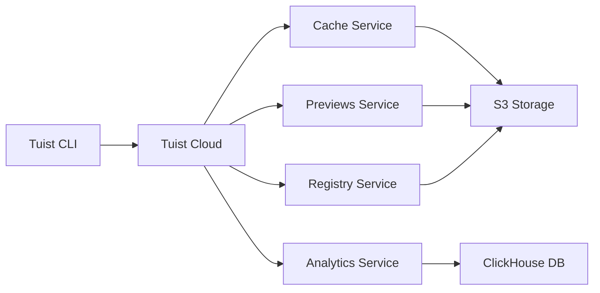

Tuist Cloud is a suite of services designed to accelerate your iOS and macOS development workflow. By integrating seamlessly with the Tuist CLI, these services provide caching, insights, preview distribution, and more.

## Why Tuist Cloud?

Building and testing large iOS projects can be time-consuming. Tuist Cloud addresses these challenges by providing:

- **Faster builds** through intelligent binary caching
- **Actionable insights** from build and test analytics
- **Seamless distribution** of preview builds to QA teams
- **Bundle analysis** to track and optimize app size
- **Swift package registry** for internal dependency management

## Available Services

<CardGroup cols={2}>
  <Card title="Cache" icon="bolt" href="/cloud/cache">
    Speed up builds with binary caching for your frameworks and targets
  </Card>
  <Card title="Previews" icon="mobile" href="/cloud/previews">
    Share app builds instantly with your team for testing and feedback
  </Card>
  <Card title="QA" icon="clipboard-check" href="/cloud/qa">
    Streamline QA workflows with organized preview management
  </Card>
  <Card title="Insights" icon="chart-line" href="/cloud/insights">
    Analyze build and test data to identify bottlenecks and trends
  </Card>
  <Card title="Bundle Analysis" icon="box" href="/cloud/bundle-analysis">
    Track app bundle size and understand what contributes to binary bloat
  </Card>
  <Card title="Registry" icon="cube" href="/cloud/registry">
    Host private Swift packages with the built-in registry service
  </Card>
</CardGroup>

## Getting Started

To use Tuist Cloud services, you'll need to:

1. **Authenticate** with Tuist Cloud using the CLI
2. **Configure** your project to use cloud services
3. **Integrate** cloud commands into your development workflow

<Card title="Authentication" icon="key" href="/cloud/authentication">
  Learn how to authenticate with Tuist Cloud from the CLI
</Card>

## How It Works

Tuist Cloud services are accessed through the Tuist CLI. When you run commands like `tuist cache warm` or `tuist build`, the CLI communicates with Tuist Cloud to:

- **Upload** build artifacts and analytics data
- **Download** cached binaries to speed up builds
- **Store** preview builds for distribution
- **Collect** metrics about your project's health

All communication is secured with authentication tokens and happens transparently in the background.

## Architecture

The CLI acts as the primary interface to cloud services, handling authentication, data upload/download, and providing feedback on operations.

## Self-Hosting

Tuist Cloud can be self-hosted if you prefer to run the infrastructure yourself. The server is built with Elixir/Phoenix and uses:

- **PostgreSQL** for primary data storage
- **ClickHouse** for analytics data
- **S3-compatible storage** for artifacts

For more information about self-hosting, visit the [Tuist server repository](https://github.com/tuist/tuist).

## Next Steps

<Steps>
  <Step title="Authenticate with Tuist Cloud">
    Set up authentication to start using cloud services
    
    [Learn about authentication →](/cloud/authentication)
  </Step>
  <Step title="Enable cache for your project">
    Configure binary caching to speed up your builds
    
    [Set up cache →](/cloud/cache)
  </Step>
  <Step title="Explore other services">
    Discover how previews, insights, and other services can improve your workflow
  </Step>
</Steps>
