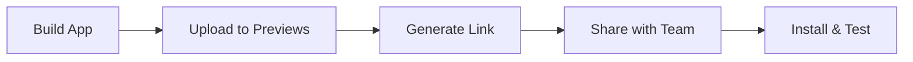

Tuist Previews makes it easy to distribute iOS, macOS, visionOS, and Android app builds to your team for testing and feedback. Upload builds directly from the CLI and share them via a web link.

## Overview

Previews solve the challenge of app distribution by:

- **Uploading** builds directly from the CLI
- **Generating** shareable web links for each build
- **Tracking** build metadata (version, commit, branch)
- **Organizing** builds by track (e.g., staging, production)
- **Supporting** multiple platforms (iOS, macOS, visionOS, Android)



## Prerequisites

1. [Authenticate with Tuist Cloud](/cloud/authentication)
2. Configure your project in `Config.swift`:

```swift Config.swift
import ProjectDescription

let config = Config(
    cloud: .cloud(
        url: "https://cloud.tuist.io",
        projectId: "your-org/your-project"
    )
)
```

## Uploading Previews

### iOS Previews (IPA)

Upload an IPA file to create a preview:

```bash
tuist build MyApp --platform iOS --configuration Release
tuist share MyApp
```

The `tuist share` command:

1. Locates the built IPA
2. Extracts app metadata (name, version, bundle ID)
3. Uploads to Tuist Cloud
4. Returns a shareable URL

Output:

```
✓ Uploading MyApp.ipa...
✓ Preview created successfully

📱 Share this link: https://cloud.tuist.io/preview/abc123
```

### macOS Previews (App Bundle)

For macOS apps, upload the `.app` bundle:

```bash
tuist build MyMacApp --platform macOS --configuration Release
tuist share MyMacApp --platform macOS
```

### Android Previews (APK)

Upload Android APK files:

```bash
tuist build MyAndroidApp --platform Android
tuist share MyAndroidApp --platform Android
```

<Info>
  Tuist automatically detects the build artifact type (IPA, APK, or App bundle) based on the platform.
</Info>

## Preview Metadata

### Git Integration

Tuist automatically captures git metadata when uploading:

```bash
tuist share MyApp
# Automatically includes:
# - Git branch
# - Commit SHA
# - Commit message
```

Manually specify git information:

```bash
tuist share MyApp \
  --git-branch feature/new-ui \
  --git-commit-sha abc123def \
  --git-ref refs/heads/feature/new-ui
```

### Build Tracks

Organize previews by track (e.g., staging, production, alpha):

```bash
tuist share MyApp --track staging
```

Tracks help organize builds:
- **staging**: Internal testing builds
- **production**: Production candidates
- **alpha**: Early feature previews
- **beta**: Public beta builds

### Version Override

Override the build version for special builds:

```bash
export TUIST_PREVIEW_BUILD_VERSION=1.2.3-hotfix
tuist share MyApp
```

Or append a suffix:

```bash
export TUIST_PREVIEW_BUILD_VERSION_SUFFIX=beta
tuist share MyApp
# Results in version like: 1.2.3-beta
```

## Managing Previews

### List Previews

View all previews for your project:

```bash
tuist preview list
```

Filter by track:

```bash
tuist preview list --track staging
```

### Preview Details

Get details about a specific preview:

```bash
tuist preview show abc123
```

Displays:
- App name and version
- Upload date and time
- Git commit information
- Supported platforms
- Download/install stats

### Delete Previews

Remove old previews:

```bash
tuist preview delete abc123
```

<Warning>
  Deleting a preview removes it permanently and invalidates all shared links.
</Warning>

## Preview Links

When you upload a preview, you receive a shareable URL:

```
https://cloud.tuist.io/preview/abc123
```

Anyone with the link can:
- View app details (name, version, icon)
- Download the build
- Install on their device (iOS/Android)
- View git commit information

### Installing iOS Previews

Recipients can install iOS previews by:

1. Opening the preview link on their iOS device
2. Tapping **Install**
3. Following iOS installation prompts

<Note>
  iOS previews require the app to be signed with an ad-hoc or enterprise provisioning profile, or the device UDID must be included in the provisioning profile.
</Note>

### Installing macOS Previews

For macOS apps:

1. Open the preview link
2. Download the `.app` bundle
3. Move to Applications folder
4. Right-click and select **Open** (first time only)

## CI/CD Integration

Automate preview uploads in your CI pipeline:

### GitHub Actions Example

```yaml .github/workflows/preview.yml
name: Upload Preview
on:
  push:
    branches: [develop, staging]

jobs:
  preview:
    runs-on: macos-latest
    steps:
      - uses: actions/checkout@v4
      
      - name: Install Tuist
        run: curl -Ls https://install.tuist.io | bash
      
      - name: Authenticate
        run: tuist auth login
      
      - name: Build app
        run: tuist build MyApp --platform iOS --configuration Release
      
      - name: Upload preview
        run: tuist share MyApp --track staging
        
      - name: Comment PR with preview link
        uses: actions/github-script@v7
        with:
          script: |
            const previewUrl = process.env.PREVIEW_URL;
            await github.rest.issues.createComment({
              issue_number: context.issue.number,
              owner: context.repo.owner,
              repo: context.repo.repo,
              body: `📱 Preview build ready: ${previewUrl}`
            });
```

### GitLab CI Example

```yaml .gitlab-ci.yml
preview:
  stage: deploy
  only:
    - develop
    - staging
  script:
    - curl -Ls https://install.tuist.io | bash
    - tuist auth login
    - tuist build MyApp --platform iOS --configuration Release
    - tuist share MyApp --track staging
  artifacts:
    reports:
      dotenv: preview.env
```

## Preview Features

### App Icons

Tuist automatically extracts and displays the app icon in the preview:

- iOS: Extracted from the IPA
- macOS: Extracted from the app bundle
- Android: Extracted from the APK

### Multi-Platform Support

A single preview can support multiple platforms:

```bash
tuist share MyApp --platforms iOS,visionOS
```

Users can choose which platform to install based on their device.

### Preview Expiration

Previews can be configured to expire automatically:

```swift Config.swift
let config = Config(
    cloud: .cloud(
        url: "https://cloud.tuist.io",
        projectId: "your-org/your-project",
        options: .options(
            previewExpirationDays: 30
        )
    )
)
```

## QA Integration

<Card title="QA Service" icon="clipboard-check" href="/cloud/qa">
  Learn how to organize previews for QA workflows
</Card>

## Advanced Usage

### Custom Upload Progress

Monitor upload progress in scripts:

```bash
tuist share MyApp --verbose
```

### Parallel Uploads

Upload multiple builds in parallel:

```bash
tuist share MyApp --platform iOS &
tuist share MyApp --platform macOS &
wait
```

### Preview Webhooks

Configure webhooks to notify external services when previews are uploaded:

```swift Config.swift
let config = Config(
    cloud: .cloud(
        url: "https://cloud.tuist.io",
        projectId: "your-org/your-project",
        options: .options(
            webhooks: [
                .webhook(
                    url: "https://your-webhook.com/preview-uploaded",
                    events: [.previewUploaded]
                )
            ]
        )
    )
)
```

## Troubleshooting

### Upload Fails

If preview upload fails:

1. Check authentication: `tuist auth whoami`
2. Verify network connectivity
3. Ensure the build artifact exists
4. Check disk space

### Preview Link Not Working

If the preview link doesn't work:

- Verify the preview wasn't deleted
- Check that the recipient has access permissions
- Ensure the preview hasn't expired

### Installation Fails (iOS)

If iOS installation fails:

- Verify the device UDID is in the provisioning profile
- Check that the app is signed correctly
- Ensure the device trusts the signing certificate

## Best Practices

<AccordionGroup>
  <Accordion title="Use tracks to organize builds">
    Create separate tracks for different testing stages (alpha, beta, staging, production).
  </Accordion>
  
  <Accordion title="Automate preview uploads in CI">
    Upload previews automatically on every merge to develop or staging branches.
  </Accordion>
  
  <Accordion title="Include git metadata">
    Always include git branch and commit information to help QA track down issues.
  </Accordion>
  
  <Accordion title="Set expiration times">
    Configure automatic expiration to save storage space and avoid confusion with old builds.
  </Accordion>
</AccordionGroup>

## Next Steps

<CardGroup cols={2}>
  <Card title="QA Service" icon="clipboard-check" href="/cloud/qa">
    Streamline QA workflows with organized preview management
  </Card>
  <Card title="Build Insights" icon="chart-line" href="/cloud/insights">
    Track preview usage and download metrics
  </Card>
</CardGroup>
