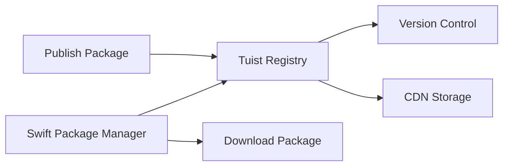

The Tuist Registry is a Swift package registry that allows you to host and manage private Swift packages for your organization. It's fully compatible with Swift Package Manager and integrated with Tuist Cloud.

## Overview

The registry provides:

- **Private package hosting**: Host internal Swift packages
- **Version management**: Semantic versioning support
- **Access control**: Organization-level permissions
- **Fast downloads**: CDN-backed distribution
- **SPM compatibility**: Works with Swift Package Manager



## Prerequisites

1. [Authenticate with Tuist Cloud](/cloud/authentication)
2. A Swift package to publish
3. Access to a Tuist organization

## Setting Up the Registry

### Initialize Registry Configuration

Run the setup command in your project:

```bash
tuist registry setup
```

This creates a registry configuration file at:

- **Xcode projects**: `.xcodeproj/project.xcworkspace/xcshareddata/swiftpm/configuration/registries.json`
- **Workspaces**: `.xcworkspace/xcshareddata/swiftpm/configuration/registries.json`
- **SPM packages**: `.swiftpm/configuration/registries.json`

### Configuration File

The generated `registries.json` looks like:

```json
{
  "version": 1,
  "registries": {
    "[default]": {
      "url": "https://cloud.tuist.io/api/registry/swift",
      "supportsAvailability": false
    }
  },
  "authentication": {
    "cloud.tuist.io": {
      "type": "token",
      "loginAPIPath": "/api/registry/swift/login"
    }
  },
  "security": {
    "default": {
      "signing": {
        "onUnsigned": "silentAllow"
      }
    }
  }
}
```

<Note>
  Commit this file to version control so your team uses the same registry configuration.
</Note>

## Registry Authentication

### Login to Registry

Authenticate with the registry:

```bash
tuist registry login
```

This command:

1. Uses your Tuist Cloud credentials
2. Generates a registry-specific token
3. Stores it in SPM's credential store

### Verify Authentication

Check your authentication status:

```bash
tuist auth whoami
```

### Logout

Remove registry credentials:

```bash
tuist registry logout
```

## Publishing Packages

### Prepare Your Package

Ensure your package has:

1. A valid `Package.swift`
2. Semantic version tags
3. Proper package metadata

Example `Package.swift`:

```swift Package.swift
// swift-tools-version: 5.9
import PackageDescription

let package = Package(
    name: "MyPrivatePackage",
    platforms: [
        .iOS(.v15),
        .macOS(.v12)
    ],
    products: [
        .library(
            name: "MyPrivatePackage",
            targets: ["MyPrivatePackage"]
        )
    ],
    dependencies: [
        // External dependencies
    ],
    targets: [
        .target(
            name: "MyPrivatePackage",
            dependencies: []
        ),
        .testTarget(
            name: "MyPrivatePackageTests",
            dependencies: ["MyPrivatePackage"]
        )
    ]
)
```

### Tag a Release

Create a version tag:

```bash
git tag 1.0.0
git push origin 1.0.0
```

### Publish to Registry

Publish your package:

```bash
swift package-registry publish your-org/MyPrivatePackage 1.0.0
```

Alternatively, use Tuist's wrapper command:

```bash
tuist registry publish MyPrivatePackage 1.0.0
```

The package is now available at:

```
https://cloud.tuist.io/registry/your-org/MyPrivatePackage
```

## Consuming Packages

### Add Dependency

After running `tuist registry setup`, add the package to your `Package.swift`:

```swift Package.swift
let package = Package(
    name: "MyApp",
    dependencies: [
        .package(
            id: "your-org.MyPrivatePackage",
            from: "1.0.0"
        )
    ],
    targets: [
        .target(
            name: "MyApp",
            dependencies: [
                .product(
                    name: "MyPrivatePackage",
                    package: "your-org.MyPrivatePackage"
                )
            ]
        )
    ]
)
```

### Using in Xcode

In Xcode projects:

1. Run `tuist registry setup` to configure the registry
2. Add the package using Xcode's package manager UI
3. Search for `your-org.MyPrivatePackage`
4. Select the version
5. Add to your target

### Using with Tuist

In Tuist projects, add to your `Package.swift` dependencies:

```swift Project.swift
import ProjectDescription

let project = Project(
    name: "MyApp",
    packages: [
        .remote(
            id: "your-org.MyPrivatePackage",
            url: "https://cloud.tuist.io/registry/your-org/MyPrivatePackage",
            from: "1.0.0"
        )
    ],
    targets: [
        Target(
            name: "MyApp",
            destinations: .iOS,
            product: .app,
            bundleId: "com.example.myapp",
            dependencies: [
                .package(product: "MyPrivatePackage")
            ]
        )
    ]
)
```

## Package Management

### List Packages

View packages in your registry:

```bash
tuist registry list
```

### Package Details

Get information about a package:

```bash
tuist registry show your-org/MyPrivatePackage
```

Shows:
- Available versions
- Publication dates
- Download statistics
- Dependencies

### Delete a Version

Remove a specific version:

```bash
tuist registry delete your-org/MyPrivatePackage 1.0.0
```

<Warning>
  Deleting a package version is permanent. Ensure no projects depend on it before deleting.
</Warning>

## Package Scoping

### Organization Packages

Packages are scoped to organizations:

```
your-org.MyPrivatePackage
your-org.AnotherPackage
other-org.TheirPackage
```

Only members of an organization can:
- Publish packages under that organization
- Access private packages

### Package Naming

Follow Swift package naming conventions:

- Use PascalCase: `MyPrivatePackage`
- Avoid special characters
- Keep names concise
- Include organization scope: `your-org.MyPrivatePackage`

## CI/CD Integration

### Publishing from CI

Automate package publishing:

```yaml .github/workflows/publish.yml
name: Publish Package
on:
  push:
    tags:
      - 'v*'

jobs:
  publish:
    runs-on: macos-latest
    steps:
      - uses: actions/checkout@v4
      
      - name: Install Tuist
        run: curl -Ls https://install.tuist.io | bash
      
      - name: Authenticate
        run: tuist auth login
      
      - name: Registry login
        run: tuist registry login
      
      - name: Publish package
        run: |
          VERSION=${GITHUB_REF#refs/tags/v}
          tuist registry publish MyPrivatePackage $VERSION
```

### Consuming in CI

Use registry packages in CI:

```yaml .github/workflows/build.yml
name: Build
on: [push, pull_request]

jobs:
  build:
    runs-on: macos-latest
    steps:
      - uses: actions/checkout@v4
      
      - name: Install Tuist
        run: curl -Ls https://install.tuist.io | bash
      
      - name: Registry login
        run: tuist registry login
      
      - name: Resolve packages
        run: tuist install
      
      - name: Build
        run: tuist build
```

## Package Discovery

### Search Packages

Search for packages in your organization:

```bash
tuist registry search networking
```

### Browse in Web UI

View packages in the Tuist Cloud dashboard:

```
https://cloud.tuist.io/your-org/registry
```

The web interface shows:
- All published packages
- Version history
- Download statistics
- Package dependencies
- README and documentation

## Advanced Features

### Package Metadata

Include rich metadata in your package:

```swift Package.swift
let package = Package(
    name: "MyPrivatePackage",
    // Metadata shown in registry
    platforms: [.iOS(.v15), .macOS(.v12)],
    products: [
        .library(
            name: "MyPrivatePackage",
            targets: ["MyPrivatePackage"]
        )
    ],
    dependencies: [],
    targets: [
        .target(
            name: "MyPrivatePackage",
            dependencies: []
        )
    ]
)
```

### Package Documentation

Include a README for your package:

```markdown README.md
# MyPrivatePackage

A private Swift package for internal use.

## Installation

Add to your `Package.swift`:

```swift
.package(id: "your-org.MyPrivatePackage", from: "1.0.0")
```

## Usage

```swift
import MyPrivatePackage

let service = MyService()
service.doSomething()
```
```

### Dependency Resolution

The registry handles transitive dependencies:

```
YourApp
├── your-org.MyPrivatePackage 1.0.0
│   ├── your-org.Networking 2.0.0
│   └── your-org.Utilities 1.5.0
└── your-org.Analytics 3.0.0
    └── your-org.Networking 2.0.0 (shared)
```

## Migration from Git Dependencies

### Before (Git)

```swift Package.swift
.package(
    url: "https://github.com/your-org/MyPrivatePackage.git",
    from: "1.0.0"
)
```

### After (Registry)

```swift Package.swift
.package(
    id: "your-org.MyPrivatePackage",
    from: "1.0.0"
)
```

Benefits:
- Faster resolution (no git clones)
- Better caching
- Centralized management
- Access control

## Troubleshooting

### Authentication Fails

If registry authentication fails:

```bash
tuist registry logout
tuist auth logout
tuist auth login
tuist registry login
```

### Package Not Found

If SPM can't find your package:

1. Verify `tuist registry setup` was run
2. Check `registries.json` is committed
3. Ensure you're authenticated: `tuist auth whoami`
4. Verify package exists: `tuist registry list`

### Publication Fails

If publishing fails:

1. Verify package name follows conventions
2. Check version tag exists
3. Ensure you have publish permissions
4. Validate `Package.swift` syntax

## Best Practices

<AccordionGroup>
  <Accordion title="Use semantic versioning">
    Follow semver strictly: major.minor.patch (e.g., 1.0.0).
  </Accordion>
  
  <Accordion title="Include comprehensive README">
    Document installation, usage, and API in your package README.
  </Accordion>
  
  <Accordion title="Test before publishing">
    Always test your package locally before publishing to the registry.
  </Accordion>
  
  <Accordion title="Maintain changelog">
    Keep a CHANGELOG.md documenting changes in each version.
  </Accordion>
  
  <Accordion title="Use organization scoping">
    Always publish packages with your organization scope.
  </Accordion>
</AccordionGroup>

## Next Steps

<CardGroup cols={2}>
  <Card title="Package Management Guide" icon="box" href="/guides/dependencies">
    Learn more about managing package dependencies
  </Card>
  <Card title="Build Optimization" icon="gauge" href="/guides/build-optimization">
    Optimize build times with package caching
  </Card>
</CardGroup>
