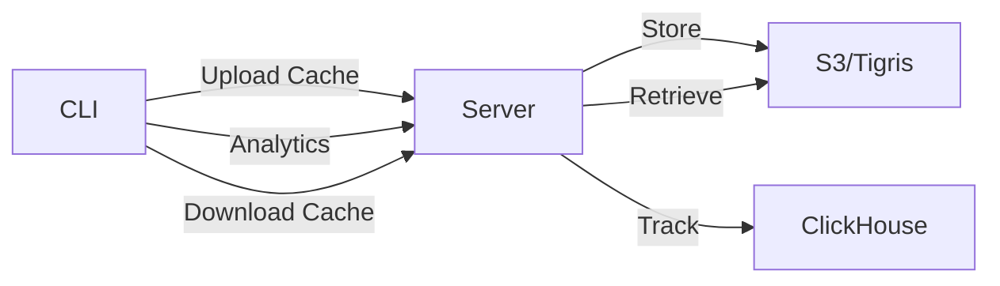

Tuist is a modular CLI tool built in Swift that helps you generate, build, and maintain Xcode projects at scale. Understanding its architecture will help you make the most of Tuist's capabilities.

## High-Level Architecture

Tuist follows a layered architecture that separates concerns and enables extensibility:

<Accordion title="Core Components" icon="layer-group">
  Tuist is organized into distinct modules, each with specific responsibilities:

  - **CLI Layer** - Command parsing and execution (entry point)
  - **Manifest Layer** - Project description types and DSL
  - **Loader Layer** - Manifest loading and validation
  - **Graph Layer** - Dependency resolution and graph modeling
  - **Generator Layer** - Xcode project generation
  - **Integration Layer** - Server, cache, and external services
</Accordion>

## Module Structure

Tuist's codebase is divided into focused modules under `cli/Sources/`:

### Core Modules

<CardGroup cols={2}>
  <Card title="ProjectDescription" icon="file-code" href="/home/daytona/workspace/source/cli/Sources/ProjectDescription">
    Public manifest DSL types (`Project`, `Target`, `Scheme`)
  </Card>
  
  <Card title="TuistCore" icon="cube">
    Domain models, analytics, and shared abstractions
  </Card>
  
  <Card title="TuistLoader" icon="arrow-down-to-bracket">
    Manifest loading, evaluation, and caching
  </Card>
  
  <Card title="XcodeGraph" icon="diagram-project">
    Graph models for dependencies and targets
  </Card>
</CardGroup>

### Feature Modules

<Tabs>
  <Tab title="Generation">
    **TuistGenerator** transforms manifests into Xcode projects:
    
    ```swift
    // Simplified generation flow
    Manifest → Graph → ProjectDescriptor → .xcodeproj
    ```
    
    - Loads `Project.swift` manifests
    - Builds dependency graph
    - Generates Xcode project files
    - Creates schemes and build phases
  </Tab>
  
  <Tab title="Caching">
    **TuistCache** provides binary caching capabilities:
    
    - Content-addressable storage (CAS)
    - Local and remote caching
    - Fingerprint-based cache hits
    - Selective testing optimization
  </Tab>
  
  <Tab title="Server Integration">
    **TuistServer** client for cloud features:
    
    - Authentication and authorization
    - Remote cache management
    - Analytics and telemetry
    - Preview deployments
  </Tab>
  
  <Tab title="Dependencies">
    **TuistDependencies** manages external dependencies:
    
    - Swift Package Manager integration
    - Carthage support
    - XCFramework handling
  </Tab>
</Tabs>

## Data Flow

Here's how data flows through Tuist when you run `tuist generate`:

<Steps>
  <Step title="Discover Manifests">
    Tuist traverses the directory tree to find `Project.swift`, `Workspace.swift`, and `Tuist.swift` files.
    
    ```bash
    /MyApp
    ├── Tuist.swift          # Global config
    ├── Workspace.swift      # Workspace definition
    └── Project.swift        # Project manifest
    ```
  </Step>
  
  <Step title="Load & Parse">
    The `TuistLoader` module:
    - Compiles manifest files as Swift code
    - Executes them in a sandboxed environment
    - Decodes JSON output into `ProjectDescription` types
    
    ```swift
    // From Project.swift manifest
    let project = Project(
        name: "MyApp",
        targets: [
            .target(
                name: "App",
                destinations: .iOS,
                product: .app,
                bundleId: "com.example.app"
            )
        ]
    )
    ```
  </Step>
  
  <Step title="Build Graph">
    `XcodeGraph` creates a complete dependency graph:
    - Resolves target dependencies
    - Validates circular dependencies
    - Links external packages
    - Determines build order
  </Step>
  
  <Step title="Generate Projects">
    `TuistGenerator` creates Xcode project files:
    - Transforms graph into `ProjectDescriptor`
    - Writes `.xcodeproj` packages
    - Generates schemes and configurations
    - Applies build settings
  </Step>
</Steps>

## Key Design Principles

<AccordionGroup>
  <Accordion title="Manifest as Code" icon="code">
    Manifests are written in Swift, providing:
    - Type safety and compile-time validation
    - Code reuse through helpers and functions
    - IDE autocomplete and refactoring support
    - Version control friendly
    
    ```swift
    // Example: Reusable helper function
    func debugSettings() -> SettingsDictionary {
        var settings: SettingsDictionary = [:]
        settings["ENABLE_TESTABILITY"] = "YES"
        settings["DEBUG_INFORMATION_FORMAT"] = "dwarf"
        return settings
    }
    ```
  </Accordion>
  
  <Accordion title="Generated Projects" icon="wand-magic-sparkles">
    Xcode projects are generated, not manually maintained:
    - Single source of truth (manifests)
    - Reproducible builds across teams
    - Eliminates merge conflicts in `.pbxproj`
    - Easy to regenerate or clean
  </Accordion>
  
  <Accordion title="Module Boundaries" icon="border-all">
    Clear separation of concerns:
    - `ProjectDescription` has no dependencies (manifest DSL)
    - `TuistLoader` bridges manifests to models
    - `TuistCore` provides shared domain logic
    - Feature modules depend on core, not each other
  </Accordion>
  
  <Accordion title="Content Addressable Storage" icon="fingerprint">
    Caching uses content hashing:
    - Deterministic fingerprints for targets
    - Cache invalidation based on content changes
    - Shared caches across teams
    - Supports selective testing
  </Accordion>
</AccordionGroup>

## Extension Points

Tuist provides several extension mechanisms:

### Plugins

<CodeGroup>
```swift Plugin Definition
// In ProjectDescriptionHelpers
import ProjectDescription

public extension Project {
    static func app(
        name: String,
        destinations: Destinations,
        dependencies: [TargetDependency] = []
    ) -> Project {
        return Project(
            name: name,
            targets: [
                .target(
                    name: name,
                    destinations: destinations,
                    product: .app,
                    bundleId: "com.company.\(name)",
                    dependencies: dependencies
                )
            ]
        )
    }
}
```

```swift Using Plugins
import ProjectDescription
import ProjectDescriptionHelpers

let project = Project.app(
    name: "MyApp",
    destinations: .iOS,
    dependencies: [
        .external(name: "Alamofire")
    ]
)
```
</CodeGroup>

### Target Scripts

Custom build phases can be added to targets:

```swift
.target(
    name: "App",
    // ...
    scripts: [
        .pre(
            script: """
            echo "Running SwiftLint..."
            swiftlint
            """,
            name: "SwiftLint",
            basedOnDependencyAnalysis: false
        )
    ]
)
```

### Resource Synthesizers

Automatic code generation for resources:

```swift
let project = Project(
    name: "MyApp",
    resourceSynthesizers: [
        .strings(),
        .assets(),
        .fonts(),
        .plists(),
        .custom(
            name: "CustomAssets",
            parser: .json,
            extensions: ["custom"]
        )
    ],
    targets: [...]
)
```

## Server Architecture

<Note>
  While the CLI is written in Swift, the Tuist Server is built with Elixir/Phoenix to handle web services, caching, and analytics at scale.
</Note>

<Tabs>
  <Tab title="CLI Architecture">
    **Swift-based command-line tool:**
    - Fast local execution
    - Direct Xcode integration
    - File system operations
    - Build orchestration
  </Tab>
  
  <Tab title="Server Architecture">
    **Elixir/Phoenix web application:**
    - Binary cache storage (S3/Tigris)
    - Analytics database (ClickHouse)
    - User authentication
    - Swift Package Registry
    - Preview deployments
  </Tab>
</Tabs>

## Integration Flow

When using Tuist Cloud features:



<CodeGroup>
```swift Tuist.swift
import ProjectDescription

let tuist = Tuist(
    fullHandle: "myorg/myproject",
    project: .tuist(
        generationOptions: .options(
            enableCaching: true
        )
    )
)
```

```bash CLI Usage
# Generate with caching
tuist generate

# Warm the cache
tuist cache warm

# Upload analytics
tuist run App  # Automatically tracked
```
</CodeGroup>

## Next Steps

<CardGroup cols={2}>
  <Card title="Generated Projects" icon="diagram-project" href="/concepts/generated-projects">
    Learn how Tuist generates Xcode projects
  </Card>
  
  <Card title="Manifests" icon="file-code" href="/concepts/manifests">
    Understand Project.swift and other manifest files
  </Card>
  
  <Card title="Workspaces" icon="folder-tree" href="/concepts/workspaces">
    Explore workspace organization
  </Card>
  
  <Card title="API Reference" icon="book" href="/api-reference/introduction">
    Complete manifest API documentation
  </Card>
</CardGroup>