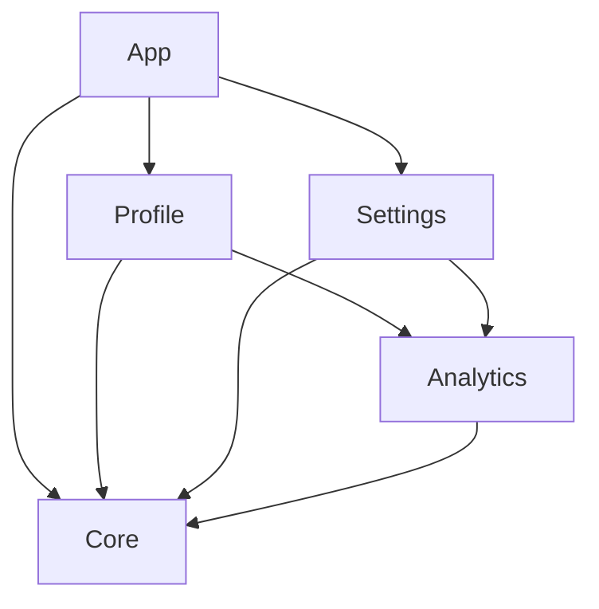

Tuist workspaces help you organize multiple projects into a cohesive development environment, enabling modular architecture and efficient team collaboration.

## Understanding Workspaces

An Xcode workspace is a container that groups multiple projects, allowing them to work together while maintaining independence.

<CardGroup cols={2}>
  <Card title="Without Workspace" icon="cube">
    Single project, all targets in one `.xcodeproj`
  </Card>
  
  <Card title="With Workspace" icon="folder-tree">
    Multiple projects organized in one `.xcworkspace`
  </Card>
</CardGroup>

### When to Use Workspaces

<Tabs>
  <Tab title="Single Project">
    **Use a single `Project.swift` when:**
    - You have a simple app structure
    - All targets are closely related
    - Team is small (< 5 developers)
    - Build times are acceptable
    
    ```bash
    /MyApp
    └── Project.swift
    ```
    
    <Note>
      Tuist automatically creates a workspace for single projects - no `Workspace.swift` needed!
    </Note>
  </Tab>
  
  <Tab title="Multiple Projects">
    **Use `Workspace.swift` when:**
    - Modular architecture with independent features
    - Large codebase split across teams
    - Want to optimize build times
    - Need to share schemes across projects
    
    ```bash
    /MyWorkspace
    ├── Workspace.swift
    ├── App/Project.swift
    ├── Features/
    │   ├── Profile/Project.swift
    │   └── Settings/Project.swift
    └── Core/Project.swift
    ```
  </Tab>
</Tabs>

## Creating a Workspace

Define a workspace in `Workspace.swift`:

<CodeGroup>
```swift Basic Workspace
import ProjectDescription

let workspace = Workspace(
    name: "MyWorkspace",
    projects: [
        "App",
        "Framework",
        "Core"
    ]
)
```

```swift Advanced Workspace
import ProjectDescription

let workspace = Workspace(
    name: "MyWorkspace",
    projects: [
        // Specific projects
        "App",
        "Core",
        
        // Glob patterns
        "Features/**",
        "Services/**"
    ],
    schemes: [
        .scheme(
            name: "AllFeatures",
            shared: true,
            buildAction: .buildAction(
                targets: [
                    .project(path: "Features/Profile", target: "Profile"),
                    .project(path: "Features/Settings", target: "Settings")
                ]
            ),
            testAction: .targets(
                [
                    .testableTarget(target: .project(path: "Features/Profile", target: "ProfileTests")),
                    .testableTarget(target: .project(path: "Features/Settings", target: "SettingsTests"))
                ]
            )
        )
    ],
    additionalFiles: [
        "README.md",
        "Documentation/**",
        ".swiftlint.yml"
    ],
    generationOptions: .options(
        autogeneratedWorkspaceSchemes: .disabled
    )
)
```
</CodeGroup>

## Workspace Structure Patterns

<Tabs>
  <Tab title="Feature-Based">
    Organize by product features:
    
    ```bash
    /MyWorkspace
    ├── Workspace.swift
    ├── App/
    │   └── Project.swift           # Main app
    ├── Features/
    │   ├── Authentication/
    │   │   └── Project.swift       # Auth feature
    │   ├── Profile/
    │   │   └── Project.swift       # Profile feature
    │   └── Settings/
    │       └── Project.swift       # Settings feature
    └── Core/
        └── Project.swift           # Shared utilities
    ```
    
    ```swift Workspace.swift
    let workspace = Workspace(
        name: "MyApp",
        projects: [
            "App",
            "Features/**",
            "Core"
        ]
    )
    ```
  </Tab>
  
  <Tab title="Layer-Based">
    Organize by architectural layers:
    
    ```bash
    /MyWorkspace
    ├── Workspace.swift
    ├── Application/
    │   └── Project.swift           # UI layer
    ├── Domain/
    │   └── Project.swift           # Business logic
    ├── Data/
    │   └── Project.swift           # Data access
    └── Infrastructure/
        └── Project.swift           # Network, storage
    ```
    
    <Note>
      This follows Clean Architecture principles with clear dependency direction
    </Note>
  </Tab>
  
  <Tab title="Micro-Features">
    Fine-grained modularization:
    
    ```bash
    /MyWorkspace
    ├── Workspace.swift
    ├── App/Project.swift
    └── Modules/
        ├── ProfileFeature/
        │   ├── Interface/Project.swift     # Public API
        │   ├── Implementation/Project.swift # Implementation
        │   └── Testing/Project.swift       # Test utilities
        └── SettingsFeature/
            ├── Interface/Project.swift
            ├── Implementation/Project.swift
            └── Testing/Project.swift
    ```
  </Tab>
  
  <Tab title="Monorepo">
    Multiple apps in one workspace:
    
    ```bash
    /MyWorkspace
    ├── Workspace.swift
    ├── Apps/
    │   ├── CustomerApp/Project.swift
    │   ├── AdminApp/Project.swift
    │   └── InternalTools/Project.swift
    ├── Shared/
    │   ├── UI/Project.swift
    │   ├── Networking/Project.swift
    │   └── Analytics/Project.swift
    └── Services/
        ├── Authentication/Project.swift
        └── API/Project.swift
    ```
  </Tab>
</Tabs>

## Cross-Project Dependencies

Link targets across projects in the workspace:

<CodeGroup>
```swift App/Project.swift
import ProjectDescription

let project = Project(
    name: "App",
    targets: [
        .target(
            name: "App",
            destinations: .iOS,
            product: .app,
            bundleId: "com.example.app",
            sources: ["Sources/**"],
            dependencies: [
                // Reference targets from other projects
                .project(target: "Profile", path: "../Features/Profile"),
                .project(target: "Settings", path: "../Features/Settings"),
                .project(target: "Core", path: "../Core")
            ]
        )
    ]
)
```

```swift Features/Profile/Project.swift
import ProjectDescription

let project = Project(
    name: "Profile",
    targets: [
        .target(
            name: "Profile",
            destinations: .iOS,
            product: .framework,
            bundleId: "com.example.profile",
            sources: ["Sources/**"],
            dependencies: [
                // Depend on Core
                .project(target: "Core", path: "../../Core")
            ]
        ),
        .target(
            name: "ProfileTests",
            destinations: .iOS,
            product: .unitTests,
            bundleId: "com.example.profile.tests",
            sources: ["Tests/**"],
            dependencies: [
                .target(name: "Profile")
            ]
        )
    ]
)
```
</CodeGroup>

<Warning>
  Avoid circular dependencies between projects. Tuist will detect and report these during generation.
</Warning>

## Workspace Schemes

Create schemes that span multiple projects:

```swift Workspace.swift
import ProjectDescription

let workspace = Workspace(
    name: "MyWorkspace",
    projects: ["App", "Features/**", "Core"],
    schemes: [
        // Build all features
        .scheme(
            name: "AllFeatures",
            shared: true,
            buildAction: .buildAction(
                targets: [
                    .project(path: "Features/Profile", target: "Profile"),
                    .project(path: "Features/Settings", target: "Settings"),
                    .project(path: "Features/Analytics", target: "Analytics")
                ]
            ),
            testAction: .targets(
                [
                    .testableTarget(target: .project(path: "Features/Profile", target: "ProfileTests")),
                    .testableTarget(target: .project(path: "Features/Settings", target: "SettingsTests"))
                ],
                options: .options(coverage: true)
            )
        ),
        
        // Integration tests
        .scheme(
            name: "Integration",
            shared: true,
            buildAction: .buildAction(
                targets: [
                    .project(path: "App", target: "App")
                ]
            ),
            testAction: .targets(
                [
                    .testableTarget(target: .project(path: "App", target: "IntegrationTests"))
                ]
            )
        ),
        
        // CI scheme
        .scheme(
            name: "CI",
            shared: true,
            buildAction: .buildAction(
                targets: [
                    .project(path: "App", target: "App"),
                    .project(path: "Core", target: "Core")
                ]
            ),
            testAction: .targets(
                [
                    .testableTarget(target: .project(path: "App", target: "AppTests")),
                    .testableTarget(target: .project(path: "Core", target: "CoreTests"))
                ],
                options: .options(
                    coverage: true,
                    codeCoverageTargets: [
                        .project(path: "App", target: "App"),
                        .project(path: "Core", target: "Core")
                    ]
                )
            )
        )
    ]
)
```

## Additional Files

Include documentation and configuration files in the workspace:

```swift
additionalFiles: [
    // Documentation
    "README.md",
    "Documentation/**",
    
    // Configuration
    ".swiftlint.yml",
    ".swiftformat",
    
    // CI/CD
    ".github/**",
    
    // Folder references (blue folders)
    .folderReference(path: "Design")
]
```

<Tip>
  Additional files appear in Xcode's project navigator but aren't built - perfect for documentation!
</Tip>

## Workspace Generation Options

Customize workspace behavior:

```swift
generationOptions: .options(
    // Disable auto-generated workspace schemes
    autogeneratedWorkspaceSchemes: .disabled,
    
    // Enable synthetic projects for Swift packages
    renderMarkdownReadme: true
)
```

## Best Practices

<AccordionGroup>
  <Accordion title="Keep Dependencies Unidirectional" icon="arrow-right">
    Ensure dependencies flow in one direction:
    
    ```
    App → Features → Core
         ↘       ↗
          Services
    ```
    
    **Avoid:**
    ```
    App ⇄ Features  ❌  (circular dependency)
    ```
    
    Use protocols/interfaces to invert dependencies when needed:
    ```swift
    // In Core
    protocol AnalyticsService {}
    
    // In Features/Analytics
    class FirebaseAnalytics: AnalyticsService {}
    
    // In App
    let analytics: AnalyticsService = FirebaseAnalytics()
    ```
  </Accordion>
  
  <Accordion title="Use Focused Workspaces for Large Teams" icon="users">
    Create team-specific workspaces:
    
    ```bash
    # Mobile team workspace
    /Mobile/Workspace.swift
    
    # Backend team workspace  
    /Backend/Workspace.swift
    
    # Shared infrastructure
    /Shared/Workspace.swift
    ```
  </Accordion>
  
  <Accordion title="Optimize Build Times" icon="gauge-high">
    Structure projects to minimize rebuilds:
    
    1. **Small, focused projects** - Changes affect fewer targets
    2. **Static frameworks** - Faster linking than dynamic
    3. **Explicit dependencies** - Avoid unnecessary rebuilds
    
    ```swift
    .target(
        name: "Core",
        product: .staticFramework,  // Fast linking
        dependencies: []             // Minimal dependencies
    )
    ```
  </Accordion>
  
  <Accordion title="Document Your Architecture" icon="book">
    Include architecture documentation in the workspace:
    
    ```swift
    additionalFiles: [
        "Architecture.md",
        "Documentation/ModuleGuide.md",
        .folderReference(path: "Documentation")
    ]
    ```
  </Accordion>
</AccordionGroup>

## Visualizing Your Workspace

Tuist can generate a visual graph of your workspace:

```bash
# Generate dependency graph
tuist graph

# Export as image
tuist graph --format png

# Skip external dependencies
tuist graph --skip-external-dependencies
```

Example output:


## Migration Strategies

<Tabs>
  <Tab title="Monolith to Modular">
    Gradually extract features from a monolithic app:
    
    <Steps>
      <Step title="Start with Core">
        Extract shared utilities first:
        ```bash
        /MyApp
        ├── App/Project.swift         # Main app (monolith)
        └── Core/Project.swift        # Extracted utilities
        ```
      </Step>
      
      <Step title="Extract Features">
        Move features one at a time:
        ```bash
        /MyApp
        ├── Workspace.swift
        ├── App/Project.swift
        ├── Features/
        │   └── Profile/Project.swift  # First extracted feature
        └── Core/Project.swift
        ```
      </Step>
      
      <Step title="Continue Extraction">
        Gradually move all features:
        ```bash
        /MyApp
        ├── Workspace.swift
        ├── App/Project.swift         # Now just app shell
        ├── Features/
        │   ├── Profile/Project.swift
        │   ├── Settings/Project.swift
        │   └── Analytics/Project.swift
        └── Core/Project.swift
        ```
      </Step>
    </Steps>
  </Tab>
  
  <Tab title="Existing Workspace">
    Migrate an existing Xcode workspace to Tuist:
    
    <Steps>
      <Step title="Create Manifests">
        Write `Project.swift` for each existing project
      </Step>
      
      <Step title="Create Workspace Manifest">
        ```swift Workspace.swift
        let workspace = Workspace(
            name: "ExistingWorkspace",
            projects: [
                "ProjectA",
                "ProjectB"
            ]
        )
        ```
      </Step>
      
      <Step title="Generate & Compare">
        ```bash
        # Generate new workspace
        tuist generate --no-open
        
        # Compare with existing workspace
        diff -r ExistingWorkspace.xcworkspace \
                 NewWorkspace.xcworkspace
        ```
      </Step>
      
      <Step title="Iterate">
        Adjust manifests until generated workspace matches
      </Step>
    </Steps>
  </Tab>
</Tabs>

## Example: Real-World Workspace

Here's a complete example of a production workspace:

<CodeGroup>
```swift Workspace.swift
import ProjectDescription

let workspace = Workspace(
    name: "ShopApp",
    projects: [
        "App",
        "Features/**",
        "Services/**",
        "Core"
    ],
    schemes: [
        .scheme(
            name: "ShopApp-Development",
            shared: true,
            buildAction: .buildAction(
                targets: [.project(path: "App", target: "ShopApp")]
            ),
            testAction: .targets(
                [
                    .testableTarget(target: .project(path: "App", target: "ShopAppTests")),
                    .testableTarget(target: .project(path: "Features/Catalog", target: "CatalogTests"))
                ],
                options: .options(coverage: true)
            ),
            runAction: .runAction(
                executable: .project(path: "App", target: "ShopApp"),
                arguments: .arguments(
                    environmentVariables: [
                        "API_URL": "https://dev-api.shop.com"
                    ]
                )
            )
        )
    ],
    additionalFiles: [
        "README.md",
        "Documentation/**"
    ]
)
```

```bash Directory Structure
/ShopApp
├── Workspace.swift
├── Tuist.swift
├── App/
│   └── Project.swift
├── Features/
│   ├── Catalog/
│   │   └── Project.swift
│   ├── Cart/
│   │   └── Project.swift
│   ├── Checkout/
│   │   └── Project.swift
│   └── Profile/
│       └── Project.swift
├── Services/
│   ├── Networking/
│   │   └── Project.swift
│   ├── Analytics/
│   │   └── Project.swift
│   └── Payment/
│       └── Project.swift
└── Core/
    └── Project.swift
```
</CodeGroup>

## Next Steps

<CardGroup cols={2}>
  <Card title="Manifests" icon="file-code" href="/concepts/manifests">
    Deep dive into manifest file structure
  </Card>
  
  <Card title="Generated Projects" icon="wand-magic-sparkles" href="/concepts/generated-projects">
    Understand project generation
  </Card>
  
  <Card title="Architecture" icon="diagram-project" href="/concepts/architecture">
    Learn about Tuist's architecture
  </Card>
  
  <Card title="Dependencies" icon="link" href="/essentials/dependencies">
    Managing external dependencies
  </Card>
</CardGroup>