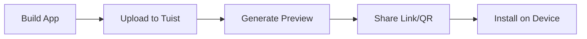

Tuist App Previews allow you to share your iOS, tvOS, watchOS, visionOS, and Android apps with teammates, stakeholders, or testers without going through App Store or TestFlight distribution.

## Overview

App Previews provide:
- **Instant sharing** - Generate shareable links and QR codes in seconds
- **No provisioning hassles** - Tuist handles all the complexity
- **Multi-platform support** - iOS, tvOS, watchOS, visionOS, and Android
- **Track-based distribution** - Organize previews by branch, environment, or purpose
- **Version management** - Keep historical versions accessible

<Info>
  Previews are perfect for design reviews, stakeholder demos, and QA testing without App Store distribution.
</Info>

## How It Works



1. **Build** your app with Tuist or Xcode
2. **Upload** the .ipa or .apk to Tuist Cloud
3. **Share** the generated link or QR code
4. **Install** directly on devices

## Creating Previews

### From Command Line

<Steps>
  <Step title="Build your app">
    Build your project for the desired platform:
    ```bash
    # Build for iOS
    tuist build --platform iOS --configuration Release
    ```
  </Step>
  
  <Step title="Share the app">
    Upload and create a preview:
    ```bash
    tuist share
    ```
    
    Tuist will:
    - Find the built .ipa in your derived data
    - Upload it to Tuist Cloud
    - Generate a shareable link and QR code
  </Step>
  
  <Step title="Distribute the link">
    Share the preview URL with your team:
    ```
    ✓ Preview created successfully!
    
    🔗 https://tuist.dev/acme/myapp/previews/abc123
    📱 Scan QR code to install
    ```
  </Step>
</Steps>

### Specify App Path

If you have multiple apps or a custom build location:

```bash
# Share specific .ipa file
tuist share MyApp.ipa

# Share .apk for Android
tuist share MyApp.apk

# Share from custom derived data path
tuist share --derived-data-path ~/CustomDerivedData
```

### Multiple Platforms

Share apps for multiple platforms at once:

```bash
# Share iOS and tvOS builds
tuist share --platforms iOS tvOS

# Share specific configuration
tuist share --configuration Release --platforms iOS
```

## Tracks

Tracks allow you to organize previews by purpose, environment, or git branch.

<Tabs>
  <Tab title="Feature Branches">
    ```bash
    # Development track
    tuist share --track dev
    
    # Feature track
    tuist share --track feature/new-ui
    
    # Beta track  
    tuist share --track beta
    ```
  </Tab>
  
  <Tab title="Environments">
    ```bash
    # Staging environment
    tuist share --track staging
    
    # Production preview
    tuist share --track production
    ```
  </Tab>
  
  <Tab title="Teams">
    ```bash
    # Design team
    tuist share --track design-review
    
    # QA team
    tuist share --track qa
    ```
  </Tab>
</Tabs>

<Info>
  Each track maintains its own preview history, making it easy to manage multiple distribution channels.
</Info>

## Installing Previews

### iOS, tvOS, watchOS, visionOS

<Steps>
  <Step title="Open the preview link">
    Tap the link on your iOS device or scan the QR code
  </Step>
  
  <Step title="Install the profile">
    Tap "Install" to add the app installation profile
  </Step>
  
  <Step title="Trust the profile">
    Go to **Settings > General > VPN & Device Management**
    
    Trust the Tuist profile
  </Step>
  
  <Step title="Launch the app">
    The app appears on your home screen, ready to use!
  </Step>
</Steps>

<Warning>
  First-time installation requires trusting the Tuist enterprise profile. This is a one-time setup per device.
</Warning>

### Android

<Steps>
  <Step title="Open the preview link">
    Tap the link on your Android device or scan the QR code
  </Step>
  
  <Step title="Download the APK">
    Chrome/Browser will download the .apk file
  </Step>
  
  <Step title="Allow installation">
    Enable "Install from unknown sources" if prompted
  </Step>
  
  <Step title="Install the app">
    Open the downloaded .apk and follow installation prompts
  </Step>
</Steps>

## Preview Management

### View Previews

List all previews for your project in the Tuist Cloud dashboard:

```bash
tuist project show
```

Or visit `https://tuist.dev/your-account/your-project/previews`

### Preview Information

Each preview includes:
- **Build version** and **bundle identifier**
- **Git commit** information (if available)
- **Supported platforms** (iOS, tvOS, watchOS, visionOS, Android)
- **Created by** and **creation date**
- **QR code** for easy device installation
- **Download link** for the binary

### Delete Previews

Previews are automatically managed, but you can delete them from the dashboard if needed.

## CI/CD Integration

### Automatic Preview Creation

Create previews automatically in your CI pipeline:

<CodeGroup>
```yaml GitHub Actions
name: Create Preview
on:
  pull_request:
    branches: [main]

jobs:
  preview:
    runs-on: macos-latest
    steps:
      - uses: actions/checkout@v3
      
      - name: Install Tuist
        run: curl -Ls https://install.tuist.io | bash
      
      - name: Build and create preview
        run: |
          tuist build --platform iOS --configuration Release
          tuist share --track pr-${{ github.event.pull_request.number }}
        env:
          TUIST_TOKEN: ${{ secrets.TUIST_TOKEN }}
      
      - name: Comment preview link
        uses: actions/github-script@v6
        with:
          script: |
            github.rest.issues.createComment({
              issue_number: context.issue.number,
              owner: context.repo.owner,
              repo: context.repo.repo,
              body: '🚀 Preview ready! Install from: [Preview Link](https://tuist.dev/...)'
            })
```

```yaml GitLab CI
previews:
  stage: deploy
  script:
    - curl -Ls https://install.tuist.io | bash
    - tuist build --platform iOS --configuration Release
    - tuist share --track $CI_COMMIT_REF_SLUG
  only:
    - merge_requests
  variables:
    TUIST_TOKEN: $TUIST_TOKEN
```
</CodeGroup>

### Preview Link in PR Comments

Automatically post preview links to pull requests so reviewers can test changes immediately.

## Advanced Features

### Git Integration

Previews automatically capture git metadata:
- **Commit SHA** - Which commit the preview was built from
- **Branch name** - The git branch
- **Commit message** - For context

### Preview Analytics

Track preview usage in the Tuist Cloud dashboard:
- Number of installations
- Unique devices
- Installation success rate

### Icon Customization

Previews display your app icon automatically. The icon is extracted from your app bundle.

## Best Practices

<AccordionGroup>
  <Accordion title="Use tracks strategically" icon="tags">
    - Use `main` track for production-ready builds
    - Use `dev` track for internal testing
    - Use PR numbers or feature names for feature previews
    - Keep track names descriptive and consistent
  </Accordion>
  
  <Accordion title="Automate in CI" icon="gears">
    - Create previews automatically on PR creation
    - Post preview links as PR comments
    - Clean up old previews to save storage
    - Use separate tracks per environment
  </Accordion>
  
  <Accordion title="Communicate with stakeholders" icon="comments">
    - Include installation instructions in links
    - Mention supported platforms
    - Provide context about what's changed
    - Use QR codes for quick device installation
  </Accordion>
</AccordionGroup>

## Platform Support

<CardGroup cols={3}>
  <Card title="iOS" icon="mobile">
    iPhone and iPad
    
    iOS 13.0+
  </Card>
  <Card title="tvOS" icon="tv">
    Apple TV
    
    tvOS 13.0+
  </Card>
  <Card title="watchOS" icon="watch">
    Apple Watch
    
    watchOS 6.0+
  </Card>
  <Card title="visionOS" icon="eye">
    Apple Vision Pro
    
    visionOS 1.0+
  </Card>
  <Card title="macOS" icon="desktop">
    Mac computers
    
    macOS 11.0+
  </Card>
  <Card title="Android" icon="android">
    Android devices
    
    Android 6.0+
  </Card>
</CardGroup>

## Troubleshooting

<AccordionGroup>
  <Accordion title="Preview upload fails" icon="cloud-xmark">
    **Possible causes:**
    - Network connectivity issues
    - File too large (max 2GB)
    - Authentication expired
    
    **Solutions:**
    - Check your internet connection
    - Verify `tuist auth` is current
    - Try uploading a smaller build
  </Accordion>
  
  <Accordion title="Can't install on device" icon="mobile-screen">
    **Possible causes:**
    - Profile not trusted
    - Device storage full
    - Incompatible iOS version
    
    **Solutions:**
    - Trust the profile in Settings
    - Free up device storage
    - Check minimum iOS version
  </Accordion>
  
  <Accordion title="QR code doesn't work" icon="qrcode">
    **Possible causes:**
    - Camera doesn't recognize QR codes
    - Need to use Safari/Chrome
    
    **Solutions:**
    - Manually type the preview URL
    - Use the Camera app (iOS) or Chrome (Android)
    - Copy the link instead
  </Accordion>
</AccordionGroup>

## Next Steps

<CardGroup cols={2}>
  <Card title="Automated QA" icon="robot" href="/features/qa">
    Test previews automatically with AI-powered QA
  </Card>
  <Card title="Build Insights" icon="chart-line" href="/features/insights">
    Monitor preview build times and success rates
  </Card>
</CardGroup>
