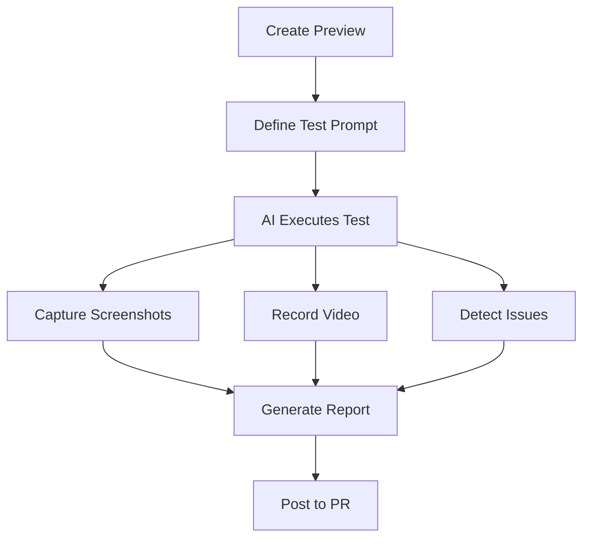

Tuist's Automated QA uses AI to test your app previews, finding bugs, UI issues, and unexpected behavior before your users do.

## Overview

<Info>
  Automated QA leverages Claude and GPT models to interact with your app like a real user, following test prompts and reporting issues automatically.
</Info>

Automated QA provides:
- **Natural language test prompts** - Describe tests in plain English
- **AI-powered execution** - Claude/GPT controls the app
- **Visual documentation** - Screenshots and screen recordings of every test
- **Issue detection** - Automatic identification of crashes, errors, and UI problems
- **VCS integration** - Post test summaries to pull requests

## How It Works



1. **Create a preview** of your app
2. **Write a test prompt** describing what to test
3. **AI agent launches** the app and follows your instructions
4. **Issues are detected** and documented with screenshots
5. **Test report** is generated and posted to your pull request

## Creating QA Tests

### Basic Test

<Steps>
  <Step title="Create an app preview">
    First, create a preview of your app:
    ```bash
    tuist share
    ```
  </Step>
  
  <Step title="Run a QA test">
    Define what to test in natural language:
    ```bash
    tuist qa run "Open the app, log in with test credentials, \
      navigate to the profile screen, and verify the user's name is displayed"
    ```
  </Step>
  
  <Step title="View results">
    Watch the test execute in real-time or check the results in Tuist Cloud:
    ```
    ✓ QA test started
    🔗 https://tuist.dev/acme/myapp/qa/runs/xyz789
    ```
  </Step>
</Steps>

### Test Prompts

Write effective test prompts by:

<CardGroup cols={2}>
  <Card title="Be Specific" icon="bullseye">
    "Tap the blue Login button in the top right"
    
    Not: "Log in"
  </Card>
  <Card title="Include Context" icon="book">
    "Navigate to Settings > Account > Privacy"
    
    Not: "Check privacy settings"
  </Card>
  <Card title="Define Success" icon="check">
    "Verify the success message appears"
    
    Not: "Submit the form"
  </Card>
  <Card title="Mention Credentials" icon="key">
    "Use email: test@example.com, password: Test123"
    
    Not: "Sign in"
  </Card>
</CardGroup>

### Example Test Prompts

<Tabs>
  <Tab title="Authentication">
    ```
    Test the login flow:
    1. Launch the app
    2. Tap 'Sign In'
    3. Enter email: test@tuist.io
    4. Enter password: TestPass123
    5. Tap 'Log In' button
    6. Verify the home screen loads
    7. Check that the user's name appears in the top right
    ```
  </Tab>
  
  <Tab title="E-commerce">
    ```
    Test the checkout process:
    1. Browse to the Products tab
    2. Select the first product
    3. Tap 'Add to Cart'
    4. Navigate to the cart
    5. Verify the product is listed
    6. Tap 'Checkout'
    7. Fill in test payment details
    8. Complete the purchase
    9. Verify the confirmation screen shows
    ```
  </Tab>
  
  <Tab title="Navigation">
    ```
    Test navigation throughout the app:
    1. Start on the home screen
    2. Navigate to each main tab
    3. Verify content loads on each screen
    4. Check for any error messages
    5. Test the back button from each screen
    6. Return to home and verify state is preserved
    ```
  </Tab>
</Tabs>

## Test Configuration

### Launch Arguments

Pass launch arguments to configure your app for testing:

```bash
tuist qa run "Test the feature" \
  --launch-arguments "-UITest YES -MockData enabled"
```

### App Description

Provide context about your app to improve AI understanding:

```swift
// In your project configuration
import ProjectDescription

let project = Project(
    qaAppDescription: """
        MyApp is a social media application.
        Users can create posts, follow friends, and chat.
        The app requires login before accessing any features.
        """
)
```

### Test Credentials

Configure default test credentials:

```swift
let project = Project(
    qaEmail: "test@example.com",
    qaPassword: "TestPassword123"
)
```

<Warning>
  Never commit real user credentials. Use test accounts specific to QA testing.
</Warning>

## Understanding Results

### Test Report

Each QA run generates a detailed report:

- **Status** - Completed, Failed, or In Progress
- **Duration** - Total test execution time
- **Steps** - Breakdown of actions taken
- **Issues** - Bugs and problems found
- **Screenshots** - Visual documentation of each step
- **Video recording** - Complete screen recording of the test

### Issue Detection

The AI automatically identifies:

<AccordionGroup>
  <Accordion title="Crashes" icon="explosion">
    - App crashes or force quits
    - Unhandled exceptions
    - System errors
  </Accordion>
  
  <Accordion title="UI Issues" icon="mobile-screen-button">
    - Missing or broken UI elements
    - Incorrect labels or text
    - Layout problems
  </Accordion>
  
  <Accordion title="Functional Issues" icon="gears">
    - Buttons that don't respond
    - Failed network requests
    - Incorrect app behavior
  </Accordion>
  
  <Accordion title="Performance Issues" icon="gauge-high">
    - Slow loading screens
    - Laggy interactions
    - Memory warnings
  </Accordion>
</AccordionGroup>

### Test Logs

View detailed logs of AI decision-making:

```
10:23:45 ASSISTANT: Launching app
10:23:47 TOOL: screenshot - Captured home screen
10:23:48 ASSISTANT: Locating login button
10:23:49 TOOL: tap - Tapped 'Sign In' at (200, 450)
10:23:50 TOOL: screenshot - Login screen displayed
10:23:51 ASSISTANT: Entering test credentials
10:23:52 TOOL: type_text - Entered email
```

## VCS Integration

Automatically post test results to your pull requests:

### Setup

<Steps>
  <Step title="Connect VCS">
    Link your GitHub/GitLab repository in Tuist Cloud
  </Step>
  
  <Step title="Enable PR comments">
    Configure QA to post comments automatically:
    ```bash
    tuist project update --enable-qa-comments
    ```
  </Step>
  
  <Step title="Run QA in CI">
    Add QA tests to your CI pipeline:
    ```yaml
    - name: Run QA tests
      run: |
        tuist share
        tuist qa run "Test core user flows"
    ```
  </Step>
</Steps>

### PR Comments

QA results appear as comments on your pull request:

```markdown
## 🤖 Tuist QA Test Results

**Status:** ✅ Passed (3/3 flows tested)
**Duration:** 2m 34s

### Test Summary
- ✅ User login flow
- ✅ Product browsing
- ✅ Checkout process

### Issues Found
- ⚠️ Minor: Loading spinner doesn't center on iPad

[View Full Report](https://tuist.dev/acme/myapp/qa/runs/xyz)
```

## CI/CD Integration

<CodeGroup>
```yaml GitHub Actions
name: QA Tests
on:
  pull_request:
    branches: [main]

jobs:
  qa:
    runs-on: macos-latest
    steps:
      - uses: actions/checkout@v3
      
      - name: Install Tuist
        run: curl -Ls https://install.tuist.io | bash
      
      - name: Build preview
        run: tuist build --platform iOS --configuration Release
      
      - name: Create preview
        run: tuist share --track pr-${{ github.event.pull_request.number }}
        env:
          TUIST_TOKEN: ${{ secrets.TUIST_TOKEN }}
      
      - name: Run QA tests
        run: |
          tuist qa run "Complete user onboarding flow" \
            --wait
        env:
          TUIST_TOKEN: ${{ secrets.TUIST_TOKEN }}
```

```yaml GitLab CI
qa_test:
  stage: test
  script:
    - curl -Ls https://install.tuist.io | bash
    - tuist build --platform iOS --configuration Release
    - tuist share --track $CI_COMMIT_REF_SLUG
    - tuist qa run "Test main user flows" --wait
  only:
    - merge_requests
  variables:
    TUIST_TOKEN: $TUIST_TOKEN
```
</CodeGroup>

<Tip>
  Use `--wait` flag to make CI wait for QA completion. Without it, the command returns immediately.
</Tip>

## Best Practices

<CardGroup cols={2}>
  <Card title="Test Critical Flows" icon="route">
    Focus on user journeys that must work:
    - Authentication
    - Core features
    - Checkout/payments
    - Navigation
  </Card>
  
  <Card title="Keep Tests Focused" icon="crosshairs">
    Each test should validate one flow:
    - Don't combine unrelated features
    - Break complex flows into steps
    - Test edge cases separately
  </Card>
  
  <Card title="Use Test Data" icon="database">
    Configure your app for testing:
    - Mock network responses
    - Use test accounts
    - Enable debug features
    - Fast animations
  </Card>
  
  <Card title="Review Results" icon="magnifying-glass">
    Act on QA findings:
    - Watch recordings for context
    - Fix high-priority issues
    - Update test prompts as needed
    - Track issue trends
  </Card>
</CardGroup>

## Pricing & Limits

Automated QA uses AI tokens:

- **Token usage** tracked per test run
- **Costs** based on test complexity and duration
- **View usage** in Tuist Cloud billing dashboard

<Info>
  Typical test run: 50,000-200,000 tokens depending on test complexity and duration.
</Info>

## Troubleshooting

<AccordionGroup>
  <Accordion title="QA test times out" icon="clock">
    **Possible causes:**
    - Test prompt too complex
    - App hangs or freezes
    - Network delays
    
    **Solutions:**
    - Simplify test into smaller steps
    - Check app for blocking operations
    - Use mock data to avoid network calls
  </Accordion>
  
  <Accordion title="AI can't find UI elements" icon="magnifying-glass">
    **Possible causes:**
    - Element not visible on screen
    - Accessibility labels missing
    - Dynamic content loaded slowly
    
    **Solutions:**
    - Add accessibility labels to UI elements
    - Wait for content to load in test prompt
    - Use more specific descriptions
  </Accordion>
  
  <Accordion title="Test passes but issues exist" icon="question">
    **Possible causes:**
    - Test prompt not specific enough
    - AI missed subtle issues
    - Visual-only problems
    
    **Solutions:**
    - Add explicit verification steps
    - Review screenshots manually
    - Refine test prompt with more detail
  </Accordion>
</AccordionGroup>

## Next Steps

<CardGroup cols={2}>
  <Card title="App Previews" icon="mobile" href="/features/previews">
    Learn more about creating shareable previews
  </Card>
  <Card title="Build Insights" icon="chart-line" href="/features/insights">
    Track QA test trends and success rates
  </Card>
</CardGroup>
