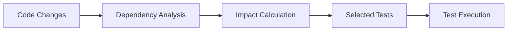

Selective testing intelligently determines which tests are impacted by your code changes, allowing you to run a focused subset of tests instead of your entire test suite.

## Overview

<Info>
  Selective testing can reduce test execution time by **60-90%** by only running tests affected by your changes.
</Info>

Tuist analyzes your dependency graph and git changes to identify:
- Tests in **modified targets**
- Tests that depend on **changed source files**
- Tests affected by **dependency changes**

### How It Works

1. **Track changes** - Tuist compares your current code against a baseline (usually `main` branch)
2. **Build dependency graph** - Maps which tests depend on which source files
3. **Calculate impact** - Determines which tests could be affected by changes
4. **Run focused tests** - Executes only the necessary test subset



## Getting Started

### Basic Usage

Selective testing is enabled by default when using `tuist test`:

```bash
# Run only tests affected by your changes
tuist test
```

<Tip>
  Tuist automatically compares against your project's default branch to determine which tests to run.
</Tip>

### First-Time Setup

<Steps>
  <Step title="Authenticate with Tuist Cloud">
    Selective testing requires Tuist Cloud to track test results:
    ```bash
    tuist auth
    ```
  </Step>
  
  <Step title="Link your project">
    ```bash
    tuist project create
    ```
  </Step>
  
  <Step title="Run your full test suite once">
    Establish a baseline by running all tests:
    ```bash
    tuist test --no-selective-testing
    ```
  </Step>
  
  <Step title="Use selective testing">
    Now selective testing will work automatically:
    ```bash
    tuist test
    ```
  </Step>
</Steps>

## Configuration

### Disable Selective Testing

Run all tests regardless of changes:

```bash
tuist test --no-selective-testing
```

### Filter by Test Type

<CodeGroup>
```bash Unit Tests Only
tuist test --skip-ui-tests
```

```bash UI Tests Only
tuist test --skip-unit-tests
```
</CodeGroup>

### Specify Test Targets

Run specific tests even with selective testing:

```bash
# Run all tests in a target
tuist test --test-targets MyAppTests

# Run specific test class
tuist test --test-targets MyAppTests/UserServiceTests

# Run specific test method
tuist test --test-targets MyAppTests/UserServiceTests/testUserLogin
```

## How Tests Are Selected

### Scenarios

<AccordionGroup>
  <Accordion title="Modified source file" icon="file-code">
    **Change:** Edit `UserService.swift`
    
    **Selected tests:**
    - All tests in targets that depend on the module containing `UserService.swift`
    - Tests that directly import or use `UserService`
  </Accordion>
  
  <Accordion title="Modified test file" icon="flask">
    **Change:** Edit `UserServiceTests.swift`
    
    **Selected tests:**
    - Only tests within `UserServiceTests.swift`
  </Accordion>
  
  <Accordion title="Dependency change" icon="diagram-project">
    **Change:** Update Alamofire from 5.8.0 to 5.9.0
    
    **Selected tests:**
    - All tests in targets that depend on Alamofire
    - All tests in targets that transitively depend on Alamofire
  </Accordion>
  
  <Accordion title="No changes" icon="equals">
    **Change:** No modified files
    
    **Selected tests:**
    - None (Tuist reports "No tests to run")
    - You can still force run with `--no-selective-testing`
  </Accordion>
</AccordionGroup>

## CI/CD Integration

### Pull Request Testing

Selective testing shines in CI environments:

```yaml GitHub Actions
name: Test
on: [pull_request]
jobs:
  test:
    runs-on: macos-latest
    steps:
      - uses: actions/checkout@v3
        with:
          fetch-depth: 0  # Important: fetch full history
      
      - name: Install Tuist
        run: curl -Ls https://install.tuist.io | bash
      
      - name: Run selective tests
        run: tuist test
        env:
          TUIST_TOKEN: ${{ secrets.TUIST_TOKEN }}
```

<Warning>
  Make sure to fetch the full git history (`fetch-depth: 0`) so Tuist can compare changes against the base branch.
</Warning>

### Main Branch Testing

Always run full test suite on main:

```yaml
name: Test Main
on:
  push:
    branches: [main]
jobs:
  test:
    runs-on: macos-latest
    steps:
      - uses: actions/checkout@v3
      
      - name: Install Tuist
        run: curl -Ls https://install.tuist.io | bash
      
      - name: Run all tests
        run: tuist test --no-selective-testing
        env:
          TUIST_TOKEN: ${{ secrets.TUIST_TOKEN }}
```

## Caching Integration

Selective testing works seamlessly with binary caching:

```bash
# Tests use cached binaries when possible
tuist test
```

Tuist will:
1. Use cached binaries for unchanged dependencies
2. Run only tests affected by your changes
3. Upload test results to Tuist Cloud

<Info>
  Combining selective testing with binary caching can reduce test time by **80-95%** in CI.
</Info>

## Understanding Test Results

### Test Summary

After running tests, Tuist shows:

```bash
✓ Selected 15 tests (skipped 142)
✓ All tests passed in 23.4s

Test selection breakdown:
  - 8 tests in modified targets
  - 7 tests affected by dependency changes
  - 142 tests skipped (no changes detected)
```

### Cloud Dashboard

View detailed test analytics in Tuist Cloud:
- Test execution time trends
- Selective testing impact
- Flaky test detection
- Test success rates

## Best Practices

<CardGroup cols={2}>
  <Card title="Modular Architecture" icon="cubes">
    Break your app into focused modules. Smaller, well-defined dependencies lead to better test selection.
  </Card>
  
  <Card title="Stable Dependencies" icon="diagram-project">
    Keep stable code in separate frameworks. Infrequently changing dependencies won't trigger unnecessary tests.
  </Card>
  
  <Card title="Comprehensive Tests" icon="flask">
    Write tests that cover public interfaces. Tuist selects tests based on dependency relationships.
  </Card>
  
  <Card title="Fast Test Execution" icon="bolt">
    Optimize individual test speed. Selective testing reduces quantity, but each test should still be fast.
  </Card>
</CardGroup>

## Troubleshooting

<AccordionGroup>
  <Accordion title="Too many tests selected" icon="list-check">
    **Possible causes:**
    - Changes in a low-level dependency affect many targets
    - Wide dependency graph (everything depends on core framework)
    - Project structure needs modularization
    
    **Solutions:**
    - Break up large, widely-used frameworks
    - Use protocols to decouple dependencies
    - Consider vertical slicing of features
  </Accordion>
  
  <Accordion title="No tests selected" icon="circle-xmark">
    **Possible causes:**
    - No source changes detected
    - Changes are in non-code files (e.g., README)
    - Git comparison issues
    
    **Solutions:**
    - Verify changes with `git status`
    - Use `--no-selective-testing` to force run
    - Check baseline branch configuration
  </Accordion>
  
  <Accordion title="Tests not uploaded to cloud" icon="cloud-xmark">
    **Possible causes:**
    - Not authenticated with Tuist Cloud
    - Network connectivity issues
    - Project not linked
    
    **Solutions:**
    - Run `tuist auth` to authenticate
    - Check network connectivity
    - Verify project link with `tuist project show`
  </Accordion>
</AccordionGroup>

## Performance Impact

<CardGroup cols={3}>
  <Card title="Small Changes" icon="file">
    **90-95% reduction**
    
    Single file modifications
  </Card>
  <Card title="Medium Changes" icon="folder">
    **60-80% reduction**
    
    Multiple related changes
  </Card>
  <Card title="Large Changes" icon="folders">
    **20-40% reduction**
    
    Core dependency updates
  </Card>
</CardGroup>

## Next Steps

<CardGroup cols={2}>
  <Card title="Build Insights" icon="chart-line" href="/features/insights">
    Analyze test performance and coverage
  </Card>
  <Card title="Binary Caching" icon="box" href="/features/cache">
    Speed up test builds with caching
  </Card>
</CardGroup>
